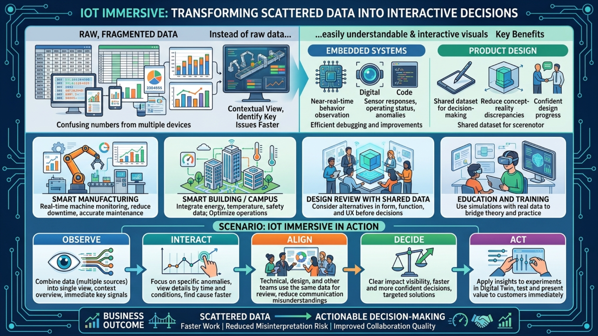
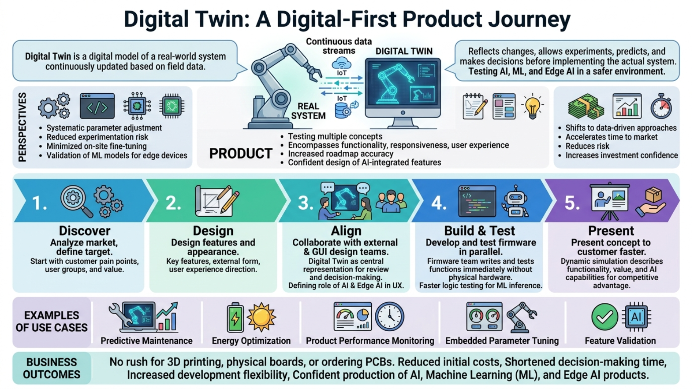

# M1 - Introduction to IoT Immersive and Digital Twin

## Introduction

บทเรียนนี้พาเริ่มต้นจากภาพใหญ่ของ **IoT Immersive** และ **Digital Twin** ในมุมที่ใช้งานได้จริงกับการพัฒนาผลิตภัณฑ์ การออกแบบระบบ และการสื่อสารเชิงธุรกิจ โดยเชื่อมต่อแนวคิด **AI, Machine Learning (ML), และ Edge AI** เข้ากับลำดับงานเดียวกันอย่างเป็นธรรมชาติ ผ่านการใช้งาน **TESAIoT Digital Twin** ซึ่งเป็นแพลตฟอร์มสำเร็จรูป

ผู้ใช้สามารถเปิดได้ทั้งแบบ **ส่วนเสริมในโปรแกรม Visual Studio Code (VS Code Extension)** และแบบ **เว็บเบราว์เซอร์** (รวมมือถือและแท็บเล็ต) แพลตฟอร์มรองรับการรับส่งข้อมูลทั้งจากอุปกรณ์จริงและจาก **คลาวด์** ตามมาตรฐานการสื่อสาร IoT ที่ใช้ในงานอุตสาหกรรมและผลิตภัณฑ์อัจฉริยะ นอกจากนี้ยังรองรับการ **สั่งงานด้วยภาษาพูดหรือข้อความธรรมดา** (เชื่อมกับระบบ MCP และโมเดลภาษา LLM ซึ่งคล้ายการพูดคุยกับผู้ช่วยอัจฉริยะ) เพื่อให้เห็นว่าไอเดียสามารถถูกทดลอง นำเสนอ และต่อยอดได้เร็วขึ้น **โดยไม่จำเป็นต้องเขียนโปรแกรม** และแม้ยังไม่สร้างฮาร์ดแวร์จริง

ภาพนี้สรุปเส้นทางหลักของบทเรียนจากแนวคิด IoT Immersive และ Digital Twin ไปสู่การใช้งานแพลตฟอร์มจริง และการนำไปสร้างผลลัพธ์เชิงงาน/เชิงธุรกิจสำหรับผู้ใช้หลายกลุ่ม

## Objective

- เข้าใจบทบาทของ IoT Immersive และ Digital Twin ต่อการพัฒนาระบบ การออกแบบผลิตภัณฑ์ และการต่อยอดสู่งาน AI, Machine Learning (ML), and Edge AI
- เห็นความเชื่อมโยงระหว่างข้อมูลเรียลไทม์ การวิเคราะห์เชิง Machine Learning (ML) การทำงานร่วมกันของทีม และการตัดสินใจเชิงธุรกิจ
- สร้างพื้นฐานสำหรับการทดลองจริง การเรียนการสอน และการพัฒนาบริการเชิงพาณิชย์ที่มี AI, Machine Learning (ML), and Edge AI เป็นองค์ประกอบ

จากเป้าหมายข้างต้น ส่วนถัดไปจะระบุผลลัพธ์ที่ผู้เรียนควรทำได้อย่างเป็นรูปธรรมเมื่อจบบทนี้

## Learning Outcomes

- อธิบายภาพรวมการไหลของข้อมูลจากอุปกรณ์จริงและคลาวด์ (ตามมาตรฐานการสื่อสาร IoT) สู่ Digital Twin และจุดที่นำข้อมูลไปใช้กับ AI, Machine Learning (ML), และ Edge AI ได้
- อธิบายคุณค่าของ Digital Twin ต่อการลดความเสี่ยง ลดเวลา และเพิ่มคุณภาพการตัดสินใจแบบ data-driven ได้
- ยกตัวอย่าง use case ที่เหมาะกับการเรียน การทดลอง หรือการพัฒนาผลิตภัณฑ์/บริการที่มี Edge AI ได้อย่างน้อย 1 กรณี
- สรุปประโยชน์ร่วมระหว่างมุมเทคนิค มุมดีไซน์ และมุมธุรกิจ เพื่อวางแผนโครงการที่ทันสมัยและขยายผลได้

เมื่อเห็นผลลัพธ์การเรียนรู้แล้ว ส่วนถัดไปจะพาเจาะทีละแกนแนวคิด เริ่มจาก IoT Immersive ก่อน

---

## IoT Immersive

**IoT Immersive** คือการเปลี่ยนข้อมูลจากอุปกรณ์และเซนเซอร์ให้กลายเป็นภาพที่เข้าใจง่ายและโต้ตอบได้ แทนการดูค่าดิบแบบแยกส่วน ช่วยให้ทีมเห็นสถานะระบบในบริบทเดียวกัน จับประเด็นสำคัญได้เร็วขึ้น และพร้อมต่อยอดสู่ AI-driven insight ได้ทันที

ในงานระบบอุปกรณ์อัจฉริยะและระบบฝังตัว แนวทางนี้ช่วยให้สังเกตพฤติกรรมระบบใกล้เคียงเวลาจริง เช่น การตอบสนองของเซนเซอร์ สถานะการทำงาน และความผิดปกติเป็นช่วงเวลา ทำให้ **ตรวจจับและแก้ไขปัญหาเบื้องต้น** และปรับปรุงระบบได้มีประสิทธิภาพกว่าเดิม พร้อมวางฐานข้อมูลสำหรับการวิเคราะห์แบบ Machine Learning ในขั้นถัดไป

ในงานออกแบบผลิตภัณฑ์ IoT Immersive ช่วยให้ทีมดีไซน์และทีมพัฒนาใช้ข้อมูลชุดเดียวกันในการตัดสินใจ ลดความคลาดเคลื่อนระหว่างแนวคิดกับของจริง และช่วยให้การออกแบบเดินหน้าได้มั่นใจขึ้น โดยสามารถคุยเรื่องฟีเจอร์อัจฉริยะหรือ Edge AI capability ได้ตั้งแต่ระยะแรก และสื่อสารภาพรวมกับลูกค้าผ่าน Web Browser/มือถือ/แท็บเล็ตได้สะดวก

ตัวอย่างการใช้งาน:

- **Smart Manufacturing:** มอนิเตอร์เครื่องจักรแบบเรียลไทม์เพื่อลด downtime และวางแผนซ่อมบำรุงเชิงคาดการณ์ด้วย AI ได้แม่นยำขึ้น
- **Smart Building / Campus:** รวมข้อมูลพลังงาน อุณหภูมิ และความปลอดภัย เพื่อปรับการดำเนินงานให้คุ้มค่าและรองรับ ML-based optimization
- **Design Review with Shared Data:** ใช้ข้อมูลเดียวกันพิจารณาทางเลือกด้านรูปทรง ฟังก์ชัน และประสบการณ์ใช้งาน พร้อมวางแนวคิดฟีเจอร์ Edge AI
- **Education and Training:** ใช้สถานการณ์จำลองร่วมกับข้อมูลจริงเพื่อเชื่อมทฤษฎีกับการปฏิบัติ และแนะนำพื้นฐาน AI, Machine Learning (ML), and Edge AI อย่างเป็นขั้นตอน

### Scenario: IoT Immersive in Action

Flow การใช้ IoT Immersive ในงานรายวันที่ตัดสินใจได้เร็วขึ้น:

1. **Observe: มองเห็นสถานะระบบแบบมีบริบท**  
   ข้อมูลจากหลายแหล่งถูกรวมในมุมมองเดียว ทำให้เห็นภาพรวมพร้อมสัญญาณสำคัญทันที
2. **Interact: เจาะลึกเฉพาะจุดที่ผิดปกติ**  
   ทีมงานคลิกดูรายละเอียดตามช่วงเวลาและเงื่อนไขที่สนใจ เพื่อค้นหาสาเหตุได้เร็วขึ้นและเก็บ pattern สำหรับงาน Machine Learning
3. **Align: คุยกันบนภาพเดียวกัน**  
   ทีมเทคนิค ทีมดีไซน์ และทีมที่เกี่ยวข้องใช้ข้อมูลเดียวกันในการ review ลดการสื่อสารคลาดเคลื่อนและสื่อสาร roadmap ด้าน AI ได้ตรงกัน
4. **Decide: ตัดสินใจได้เร็วและมั่นใจขึ้น**  
   เมื่อเห็นผลกระทบอย่างชัดเจน จึงเลือกแนวทางแก้ไขหรือปรับปรุงได้ตรงจุดมากขึ้น พร้อมกำหนดจุดที่ควรใช้ AI-driven decision support
5. **Act: ส่งต่อสู่การทดลองและการนำเสนอทันที**  
   นำ insight ที่ได้ไปใช้กับการทดลองใน Digital Twin และใช้สื่อสารคุณค่าของระบบอัจฉริยะกับลูกค้าได้อย่างเป็นรูปธรรม

**Business outcome:** IoT Immersive ทำหน้าที่เป็นสะพานระหว่าง “ข้อมูลที่กระจัดกระจาย” จากอุปกรณ์จริงและ Cloud Server กับ “การตัดสินใจที่ลงมือทำได้จริง” ช่วยให้ทีมทำงานเร็วขึ้น ลดความเสี่ยงจากการตีความผิด และเพิ่มความพร้อมต่อการนำ AI, Machine Learning (ML), and Edge AI ไปใช้จริง

---

## Digital Twin

**Digital Twin** คือแบบจำลองดิจิทัลของระบบจริงที่อัปเดตตามข้อมูลภาคสนามอย่างต่อเนื่อง เมื่อระบบจริงเปลี่ยน แบบจำลองก็สะท้อนผลตาม ทำให้ทีมสามารถทดลอง คาดการณ์ และตัดสินใจก่อนลงมือกับระบบจริง รวมถึงทดลองแนวทาง AI, Machine Learning (ML), และ Edge AI บนสภาพแวดล้อมที่ปลอดภัยกว่า โดยข้อมูลสามารถมาจากทั้งอุปกรณ์จริงและคลาวด์ผ่านการสื่อสารตามมาตรฐาน IoT

ในมุมเทคนิค Digital Twin ช่วยให้ปรับพารามิเตอร์อย่างเป็นระบบ ลดความเสี่ยงจากการทดลองบนอุปกรณ์จริง และลดเวลาการปรับจูนหน้างาน พร้อมรองรับการ validation ของโมเดล Machine Learning ก่อนนำขึ้น Edge Device

ในมุมผลิตภัณฑ์ Digital Twin ช่วยให้ทดสอบหลายแนวคิดก่อนผลิตจริง ทั้งด้านฟังก์ชัน การตอบสนอง และประสบการณ์ใช้งาน จึงลดต้นทุนการแก้ไขช่วงท้าย เพิ่มความแม่นยำของ roadmap และช่วยออกแบบฟีเจอร์ที่เชื่อมกับ AI ได้มั่นใจขึ้น

ในมุมธุรกิจ Digital Twin เปลี่ยนการตัดสินใจจากการคาดเดาไปสู่การใช้ข้อมูล ช่วยเพิ่มความเร็วในการออกสู่ตลาด ลดความเสี่ยง และเพิ่มความมั่นใจในการลงทุน โดยเฉพาะในผลิตภัณฑ์ที่ต้องการความสามารถด้าน Edge AI

ตัวอย่างการใช้งาน:

- **Predictive Maintenance:** คาดการณ์การเสื่อมสภาพของอุปกรณ์เพื่อลดการหยุดระบบแบบไม่คาดคิดด้วยโมเดล AI
- **Energy Optimization:** จำลองรูปแบบการใช้พลังงานเพื่อปรับการทำงานและลดค่าใช้จ่ายด้วย ML-based optimization
- **Product Performance Monitoring:** ติดตามประสิทธิภาพหลังใช้งานจริงเพื่อวางแผนปรับปรุงรุ่นถัดไปและเทรนโมเดลเพิ่มเติม
- **Embedded Parameter Tuning:** ทดลองค่าควบคุมหลายชุดบน Twin ก่อนนำไปใช้จริงบนระบบ Edge AI
- **Feature Validation:** พิสูจน์แนวคิดฟีเจอร์ใหม่และความเป็นไปได้ของ AI feature ก่อนลงทุนพัฒนาเต็มรูปแบบ

### Scenario: Digital-first Product Journey

Flow การพัฒนาผลิตภัณฑ์แบบ digital-first ที่เห็นภาพชัด:

1. **Discover: วิเคราะห์ตลาดและกำหนดเป้าหมายสินค้า**  
   เริ่มจาก pain point ของลูกค้า กลุ่มผู้ใช้ และคุณค่าที่ต้องส่งมอบ
2. **Design: ออกแบบคุณสมบัติและรูปลักษณ์ผลิตภัณฑ์**  
   ทีมงานนิยามฟีเจอร์หลัก รูปทรงภายนอก และแนวทางประสบการณ์ใช้งาน
3. **Align: คุยร่วมกับทีมดีไซน์ทั้งภายนอกและ GUI**  
   ใช้ Digital Twin เป็นภาพกลางในการ review และตัดสินใจร่วมกัน รวมถึงกำหนดบทบาทของ AI และ Edge AI ในประสบการณ์ใช้งาน
4. **Build & Test: พัฒนาและทดสอบระบบควบคุมบนอุปกรณ์ (เฟิร์มแวร์) แบบขนาน**  
   ทีมที่รับผิดชอบซอฟต์แวร์บนบอร์ดสามารถเขียนและทดสอบฟังก์ชันบน Twin ได้ทันที โดยไม่ต้องรออุปกรณ์จริง และสามารถทดสอบพฤติกรรมที่เกี่ยวข้องกับการประมวลผล ML บนอุปกรณ์ได้เร็วขึ้น
5. **Present: นำเสนอแนวคิดต่อลูกค้าได้เร็วขึ้น**  
   ใช้ simulation เพื่ออธิบายการทำงานและคุณค่าของสินค้าอย่างเป็นรูปธรรม รวมถึงความสามารถเชิง AI ที่สร้างความแตกต่างทางการแข่งขัน

**Business outcome:** ช่วงออกแบบไม่จำเป็นต้องรีบทำ 3D printing ไม่จำเป็นต้องมีบอร์ดจริง และยังไม่จำเป็นต้องสั่งผลิต PCB ตั้งแต่ต้น ทำให้ลดต้นทุนตั้งต้น ลดเวลาในการตัดสินใจ เพิ่มความยืดหยุ่นในการพัฒนา และเข้าสู่การผลิตสินค้าที่รองรับ AI, Machine Learning (ML), and Edge AI ได้อย่างมั่นใจมากขึ้น

บทถัดไป (M2) จะต่อยอดจากแนวคิดใน M1 ไปสู่ภาพการใช้งานจริงของ TESAIoT Digital Twin Platform ทั้งในมุมองค์ประกอบระบบและตัวอย่างการใช้งานสำหรับหลายกลุ่มเป้าหมาย
