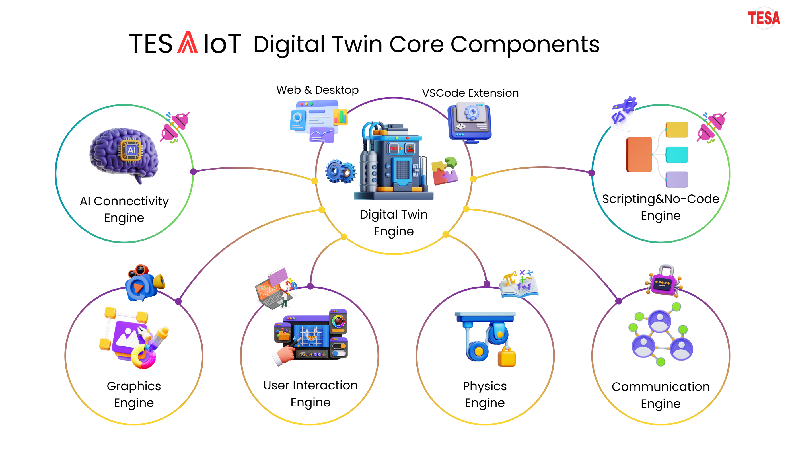
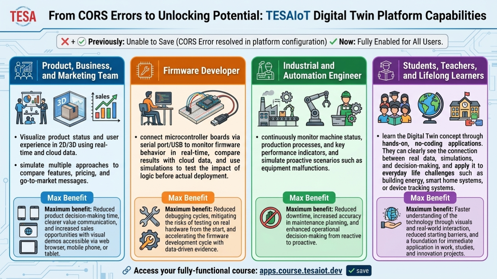
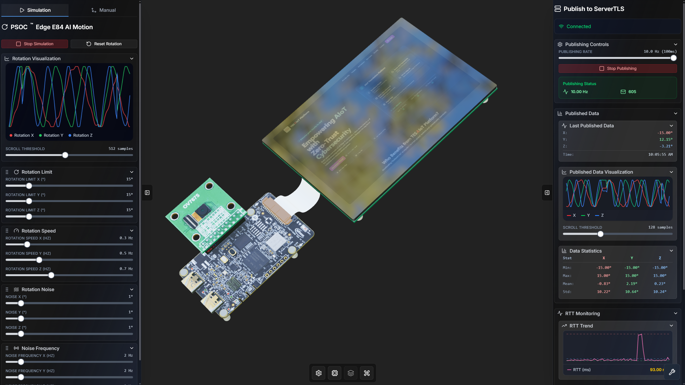

# M2 - Introduction to TESAIoT Digital Twin Platform

## Introduction

บทเรียนนี้พาไปรู้จักแพลตฟอร์ม **TESAIoT Digital Twin** ในฐานะเครื่องมือสำเร็จรูปที่ช่วยให้ทีมพัฒนาผลิตภัณฑ์ ทีมธุรกิจ ทีมการตลาด ครูและนักศึกษา และทีมที่ดูแลระบบบนอุปกรณ์ (เฟิร์มแวร์) **ทำงานร่วมกันบนข้อมูลชุดเดียวกัน** มองเห็นสถานะระบบได้ชัด ทดลองแนวคิดได้เร็ว และสื่อสารการตัดสินใจได้ง่ายขึ้น

ผู้ใช้เปิดแพลตฟอร์มได้ทั้งผ่าน **ส่วนเสริมใน Visual Studio Code** และผ่าน **เว็บเบราว์เซอร์** (รวมมือถือและแท็บเล็ต) โดยเน้นการใช้งานแบบ **ไม่ต้องเขียนโปรแกรม** เพื่อให้เริ่มต้นได้ทันที พร้อมวางพื้นฐานสำหรับการต่อยอดสู่ **AI, Machine Learning (ML), และ Edge AI** ในงานจริง แพลตฟอร์มรองรับการรับส่งข้อมูลทั้งจากอุปกรณ์จริงและจากคลาวด์ตามมาตรฐาน IoT และรองรับการ **สั่งงานด้วยภาษาพูดหรือข้อความธรรมดา** (เชื่อมกับ MCP และ LLM ซึ่งคล้ายการคุยกับผู้ช่วยอัจฉริยะ)

## Objective

- เข้าใจภาพรวมของ TESAIoT Digital Twin ทั้งบนส่วนเสริม VS Code และบนเว็บเบราว์เซอร์ และบทบาทของแพลตฟอร์มในงานพัฒนาระบบ งานออกแบบผลิตภัณฑ์ และงานวางกลยุทธ์ธุรกิจ
- เข้าใจความสามารถของแพลตฟอร์มในการสื่อสารกับอุปกรณ์จริงและคลาวด์ตามมาตรฐาน IoT
- เข้าใจความสามารถในการสั่งงานแพลตฟอร์มผ่าน MCP และ LLM ด้วยภาษาคนแบบ conversational
- เห็นฟีเจอร์หลักที่ช่วยให้ทีมทำงานเร็วขึ้น ตั้งแต่การมอนิเตอร์ข้อมูล การจำลองสถานการณ์ การทดสอบแนวคิดบนอุปกรณ์ ไปจนถึงการนำเสนอผลลัพธ์เชิงธุรกิจ
- เข้าใจเส้นทางการใช้งานแบบ no coding ที่พร้อมต่อยอดสู่ AI, Machine Learning (ML), and Edge AI ได้

## Learning Outcomes

- อธิบายองค์ประกอบหลักของ TESAIoT Digital Twin ได้อย่างเป็นลำดับ และเชื่อมโยงได้ว่าแต่ละองค์ประกอบสนับสนุนทีมใดทั้งในการใช้งานผ่าน VS Code Extension และ Web Browser
- อธิบายวิธีใช้แพลตฟอร์มเพื่อสังเกตข้อมูลจากอุปกรณ์จริงและคลาวด์ วิเคราะห์สถานการณ์ และสื่อสารการตัดสินใจให้ทั้งฝั่งวิศวกรรมและฝั่งธุรกิจเข้าใจร่วมกันได้
- อธิบายแนวทางใช้งาน MCP และ LLM เพื่อสั่งงานแพลตฟอร์มด้วยภาษาคนในระดับแนวคิดได้
- ยกตัวอย่าง use case ที่เชื่อมงาน Digital Twin เข้ากับ AI, Machine Learning (ML), and Edge AI ได้อย่างน้อย 1 กรณี
- สรุปคุณค่าเชิงธุรกิจของแพลตฟอร์มในมุมเวลา ต้นทุน ความเสี่ยง และความเร็วในการนำเสนอได้

เมื่อเห็นผลลัพธ์ที่คาดหวังแล้ว ส่วนถัดไปจะอธิบายภาพรวมแพลตฟอร์มและองค์ประกอบที่ทำให้ workflow ทั้งหมดทำงานร่วมกันได้จริง

---

## TESAIoT Digital Twin Platform Overview

**TESAIoT Digital Twin** เป็นสภาพแวดล้อมการทำงานที่รวมเครื่องมือสำคัญไว้ในจุดเดียว เพื่อช่วยให้ทีมเห็นภาพระบบจากข้อมูลจริง ทดลองทางเลือกก่อนตัดสินใจ และเตรียมความพร้อมต่อยอดสู่ระบบอัจฉริยะได้เร็วขึ้น

จุดเด่นของแพลตฟอร์มคือความยืดหยุ่นของการเข้าถึงงานแบบเดียวกันผ่านทั้งส่วนเสริม VS Code และเว็บเบราว์เซอร์ ซึ่งช่วยให้การออกแบบผลิตภัณฑ์ การทบทวนร่วมกับลูกค้า และการสื่อสารเชิงธุรกิจทำได้สะดวกขึ้นแม้อยู่นอกโต๊ะทำงาน เช่น เปิดดูผ่านโทรศัพท์หรือแท็บเล็ต ในขณะเดียวกันลำดับงานฝั่งเทคนิคยังต่อเนื่องสำหรับทีมที่ดูแลระบบบนอุปกรณ์ โดยรองรับข้อมูลทั้งจากอุปกรณ์จริงและคลาวด์ตามมาตรฐาน IoT

จากภาพสถาปัตยกรรมของแพลตฟอร์ม TESAIoT Digital Twin ระบบถูกออกแบบเป็นแกนกลางและองค์ประกอบหลักที่ทำงานร่วมกันดังนี้ โดยที่ **ผู้ใช้งานทั่วไปไม่จำเป็นต้องจำชื่อทุกส่วน** แต่การเห็นภาพรวมจะช่วยให้เข้าใจว่าแพลตฟอร์มรองรับงานประเภทใด (มองเห็นข้อมูล จำลองสถานการณ์ เชื่อมอุปกรณ์และคลาวด์ สั่งงานด้วยภาษาคน ฯลฯ):

- **Digital Twin Engine (Core):** แกนหลักของระบบสำหรับรวมข้อมูล สถานะ และกฎการทำงานของโลกจริงกับโลกดิจิทัล โดยรองรับการใช้งานทั้งบนส่วนเสริม VS Code และบนเว็บเบราว์เซอร์ ทำให้ทีมผลิตภัณฑ์และทีมที่ดูแลระบบบนอุปกรณ์เห็นภาพระบบเดียวกัน
- **Graphics Engine:** แสดงผลภาพและสถานะระบบให้เข้าใจง่าย ช่วยให้ทีม Product Design และทีมธุรกิจอ่านภาพรวมได้รวดเร็วโดยไม่ต้องแปลค่าทางเทคนิคมาก
- **Physics Engine:** รองรับการจำลองพฤติกรรมเชิงกลไกและสภาพแวดล้อม ช่วยให้ทีมเทคนิคประเมินความเป็นไปได้ก่อนพัฒนาจริง และช่วยทีมธุรกิจเห็นความเสี่ยงล่วงหน้า
- **Communication Engine:** จัดการการสื่อสารข้อมูลระหว่างแพลตฟอร์มกับอุปกรณ์จริงและคลาวด์ตามมาตรฐาน IoT รวมถึงการเชื่อมบอร์ดไมโครคอนโทรลเลอร์ผ่านสายเชื่อมต่อแบบ serial หรือ USB เพื่อให้ข้อมูลอัปเดตต่อเนื่องและตรวจสอบพฤติกรรมของระบบบนอุปกรณ์ได้ทันการณ์
- **AI Connectivity Engine:** เชื่อมข้อมูลและ workflow ไปสู่การวิเคราะห์เชิง AI, Machine Learning (ML), and Edge AI เพื่อสร้าง insight และ decision support ที่ใช้ได้ทั้งเชิงวิศวกรรมและเชิงธุรกิจ
- **User Interaction Engine:** รองรับการโต้ตอบกับข้อมูลและสถานการณ์จำลองทั้งแบบ 2D และ 3D เพื่อให้ทีมสำรวจปัญหาและตรวจสอบแนวทางได้รวดเร็ว
- **Scripting and No-Code Engine:** รองรับทั้งผู้ใช้ที่ต้องการปรับพฤติกรรมของระบบละเอียดขึ้น และผู้ใช้ที่ต้องการทำงานแบบ **ไม่เขียนโปรแกรม** ทำให้เริ่มใช้งานได้ทั้งฝั่งวิศวกรรมและฝั่งผลิตภัณฑ์/ธุรกิจ
- **MCP and LLM Integration:** รองรับการสั่งงาน application ด้วยภาษาคนผ่าน MCP และ LLM เพื่อให้ใช้งานแบบ Chatbot-like interaction ได้ ช่วยลดช่องว่างการใช้งานระหว่างทีมเทคนิคกับทีมธุรกิจ

เมื่อรวมกันทั้งหมด Components เหล่านี้ทำให้ TESAIoT Digital Twin เป็นแพลตฟอร์มที่พร้อมทั้งการมอนิเตอร์ การจำลอง การสื่อสารข้ามทีม และการต่อยอดสู่ระบบอัจฉริยะใน workflow เดียว

## Core Capabilities

จากองค์ประกอบระบบข้างต้น ส่วนนี้สรุปเป็นความสามารถหลักที่ผู้ใช้จะสัมผัสได้โดยตรงระหว่างการใช้งาน

- **Unified Workspace:** ใช้ Digital Twin Engine เป็นศูนย์กลางของมุมมองข้อมูลและการทำงาน ช่วยให้ทีมผลิตภัณฑ์ ธุรกิจ และทีมที่ดูแลระบบบนอุปกรณ์ใช้ข้อมูลชุดเดียวกัน
- **Interactive Visualization:** ใช้ Graphics Engine และ User Interaction Engine เพื่อสำรวจข้อมูลได้แบบโต้ตอบ และอธิบายสถานะระบบให้ผู้เกี่ยวข้องเข้าใจเร็ว
- **Hybrid Connectivity:** ใช้ Communication Engine เชื่อมข้อมูลกับอุปกรณ์จริงและคลาวด์ตามมาตรฐาน IoT รวมถึงการเชื่อมบอร์ดผ่านสาย serial/USB เพื่อตรวจสอบระบบบนอุปกรณ์
- **Digital Scenario Simulation:** ใช้ Physics Engine และ Digital Twin Engine เพื่อจำลองผลกระทบก่อนลงมือจริง ลดความเสี่ยงทั้งเชิงเทคนิคและต้นทุนธุรกิจ
- **Design and Review Alignment:** ใช้ workflow เดียวเพื่อ review ร่วมกันระหว่างงานระบบ งานดีไซน์ และงานผลิตภัณฑ์
- **AI-ready Data Perspective:** ใช้ AI Connectivity Engine เพื่อเตรียมข้อมูลสู่ AI, Machine Learning (ML), and Edge AI และวางแผนฟีเจอร์อัจฉริยะของสินค้า
- **Conversational Operations:** ใช้ MCP และ LLM เพื่อสั่งการ application ด้วยภาษาคน ลดข้อจำกัดด้านการใช้งานเชิงเทคนิคและเพิ่มความคล่องตัวในการทำงานร่วมกัน

---

## Example Applications

ตัวอย่างการใช้งานที่ครอบคลุม 4 กลุ่มเป้าหมายหลัก:

### Featured Example: MCU -> Digital Twin Simulation -> Cloud Workflow

*Interactive 3D simulation with real-time publish to Cloud Server in one operational workflow.*

จุดสังเกตสำคัญจากภาพนี้:
- **Left Panel - Simulation Parameters:** ปรับค่าการจำลองได้ทันทีเพื่อทดสอบหลายสถานการณ์ในเวลาสั้น
- **Center 3D View - Realistic Behavior:** เห็นการเคลื่อนไหวของโมเดล 3D เสมือนจริง ช่วยยืนยันพฤติกรรมระบบก่อนใช้งานจริง
- **Right Panel - Cloud and Communication Analytics:** ควบคุมการส่งข้อมูลไป server และวิเคราะห์ประสิทธิภาพการสื่อสารจากกราฟ/สถิติได้ในหน้าจอเดียว

ตัวอย่างนี้แสดงเส้นทางข้อมูลแบบครบวงจรจาก **บอร์ดไมโครคอนโทรลเลอร์ → การจำลอง Digital Twin → คลาวด์** โดยเริ่มจากข้อมูลจากบอร์ด (ผ่านสาย serial/USB) เข้าสู่การจำลองบนโมเดล 3D แบบเรียลไทม์ จากนั้นส่งข้อมูลต่อไปยังคลาวด์ได้ในลำดับงานเดียว จุดเด่นคือผู้ใช้สามารถปรับค่าการจำลองจากแผงด้านซ้าย ควบคุมการส่งข้อมูลไปยังเซิร์ฟเวอร์จากแผงด้านขวา และติดตามประสิทธิภาพการสื่อสารจากกราฟหรือสถิติในหน้าจอเดียว

ลำดับการทำงานที่เห็นได้จากหน้าจอ (สรุปเป็นภาษาไทยเพื่อให้ทุกกลุ่มผู้อ่านติดตามได้):

1. **รับข้อมูลจากบอร์ดไมโครคอนโทรลเลอร์ (MCU)**  
   ข้อมูลจากบอร์ดเข้าสู่ระบบผ่านสายเชื่อมต่อ (serial/USB) เพื่อเริ่มการวิเคราะห์และจำลอง
2. **ปรับค่าการจำลอง (แผงด้านซ้าย)**  
   ปรับค่าจากแผงด้านซ้ายได้ทันที เช่น มุมการหมุน ความเร็ว และเงื่อนไขการทดสอบ เพื่อเปรียบเทียบหลายสถานการณ์ในเวลาสั้น
3. **ดูภาพ 3D และตัวเลขประกอบ**  
   สังเกตผลบนภาพ 3D ที่เคลื่อนไหวเสมือนจริง พร้อมกราฟและตัวชี้วัดเพื่อยืนยันพฤติกรรมของระบบ
4. **ควบคุมการส่งข้อมูลไปคลาวด์ (แผงด้านขวา)**  
   สั่งส่งข้อมูลขึ้นคลาวด์ตามมาตรฐาน IoT ได้จากแผงด้านขวา พร้อมดูสถานะการเชื่อมต่อและจังหวะการส่งข้อมูลแบบเรียลไทม์
5. **วิเคราะห์ความลื่นไหลของการสื่อสารแล้วตัดสินใจ**  
   ใช้กราฟและสถิติ (เช่น ความต่อเนื่องของข้อมูล และเวลาตอบสนองของการสื่อสารโดยประมาณ) เพื่อทบทวน นำเสนอ และตัดสินใจเชิงผลิตภัณฑ์หรือธุรกิจได้มั่นใจขึ้น

**ทำไมจึงสำคัญ:** ลำดับงานนี้รวม **อุปกรณ์จริง การจำลอง และคลาวด์** ไว้ในหน้าจอเดียว ผู้รับผิดชอบระบบบนบอร์ดจึงได้ความเร็วในการทดสอบและตรวจการสื่อสาร ทีมผลิตภัณฑ์และธุรกิจได้เดโม 3D ที่ลูกค้าเข้าใจง่าย ทีมวิศวกรรมได้ข้อมูลที่ใช้ตัดสินใจในหน้างานได้จริง จึงเป็นแพลตฟอร์มที่ทั้ง **ใช้ปฏิบัติการได้** และ **นำเสนอคุณค่าได้** ในเวลาเดียวกัน

### 1) Product, Business, and Marketing Team

ทีมพัฒนาผลิตภัณฑ์ ทีมธุรกิจ และทีมการตลาดสามารถใช้ TESAIoT Digital Twin เพื่อดูภาพรวมสถานะสินค้าและประสบการณ์ผู้ใช้แบบสองมิติและสามมิติ จากข้อมูลจริงและข้อมูลบนคลาวด์ จากนั้นจำลองหลายแนวทางเพื่อเปรียบเทียบฟีเจอร์ ราคา และข้อความสู่ตลาด ก่อนสื่อสารกับลูกค้า

**ประโยชน์สูงสุด:** ลดเวลาในการตัดสินใจผลิตภัณฑ์ สื่อสารคุณค่าได้คมขึ้น และเพิ่มโอกาสปิดการขายด้วยเดโมที่เห็นภาพจริงผ่าน Web Browser, มือถือ, หรือแท็บเล็ต

### 2) ผู้พัฒนาระบบบนอุปกรณ์ (เฟิร์มแวร์ / สมองกลฝังตัว)

ผู้รับผิดชอบซอฟต์แวร์บนบอร์ดสามารถเชื่อมบอร์ดผ่านสาย serial หรือ USB เพื่อดูพฤติกรรมของระบบแบบเรียลไทม์ เทียบกับข้อมูลจากคลาวด์ และใช้การจำลองเพื่อดูผลกระทบก่อนนำไปใช้บนอุปกรณ์จริง

**ประโยชน์สูงสุด:** ลดรอบการแก้ไขปัญหา ลดความเสี่ยงจากการทดสอบบนอุปกรณ์จริงตั้งแต่ต้น และเร่งวงจรพัฒนาให้เร็วขึ้นโดยอิงข้อมูลจริง

### 3) Industrial and Automation Engineer

วิศวกรในโรงงานอัตโนมัติและอุตสาหกรรมอื่น ๆ สามารถใช้แพลตฟอร์มเพื่อเฝ้าดูสถานะเครื่องจักร กระบวนการผลิต และตัวชี้วัดสำคัญแบบต่อเนื่อง พร้อมจำลองเหตุการณ์ล่วงหน้า เช่น ความผิดปกติของอุปกรณ์ การเปลี่ยนพารามิเตอร์การผลิต หรือผลกระทบต่อพลังงานและต้นทุน

**ประโยชน์สูงสุด:** ลด downtime เพิ่มความแม่นยำในการวางแผนซ่อมบำรุง และยกระดับการตัดสินใจเชิงปฏิบัติการจาก reactive ไปสู่ proactive

### 4) Students, Teachers, and Lifelong Learners

นักศึกษา ครู อาจารย์ และผู้สนใจสามารถเรียนรู้แนวคิด Digital Twin ผ่านการใช้งานจริงแบบ no coding มองเห็นความเชื่อมโยงระหว่างข้อมูลจริง การจำลอง และการตัดสินใจได้ชัดเจน พร้อมต่อยอดสู่โจทย์ชีวิตประจำวัน เช่น พลังงานในอาคาร ระบบสมาร์ตโฮม หรือระบบติดตามอุปกรณ์

**ประโยชน์สูงสุด:** เข้าใจเทคโนโลยีได้เร็วขึ้นจากภาพและการโต้ตอบจริง ลดกำแพงการเริ่มต้น และสร้างพื้นฐานที่นำไปใช้ต่อในงาน การเรียน และโครงการนวัตกรรมได้ทันที

---

## Bridge to M3

เมื่อจบ M2 ผู้เรียนจะมีภาพชัดเจนทั้งในมุมองค์ประกอบแพลตฟอร์ม ความสามารถหลัก และตัวอย่างการใช้งานจริงข้ามหลายกลุ่มเป้าหมาย ขั้นถัดไปคือการลงมือเตรียมสภาพแวดล้อมจริงใน **M3 - Installation and Setup** เพื่อให้สามารถเริ่มใช้งานกับบอร์ด **PSoC Edge AI**, การเชื่อมต่อข้อมูล, และ workflow การทดลองได้อย่างมั่นใจ
