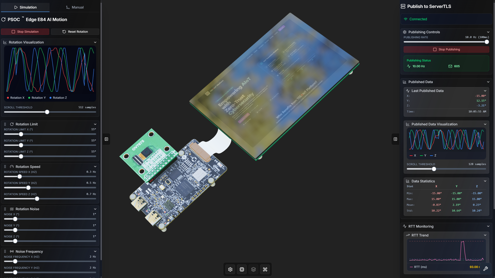
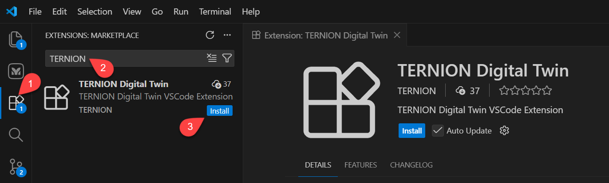
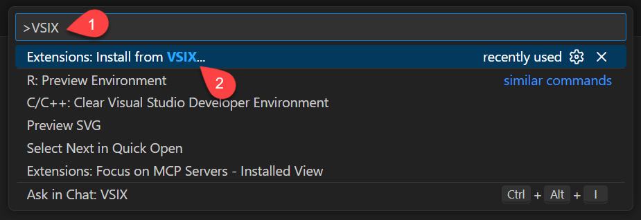
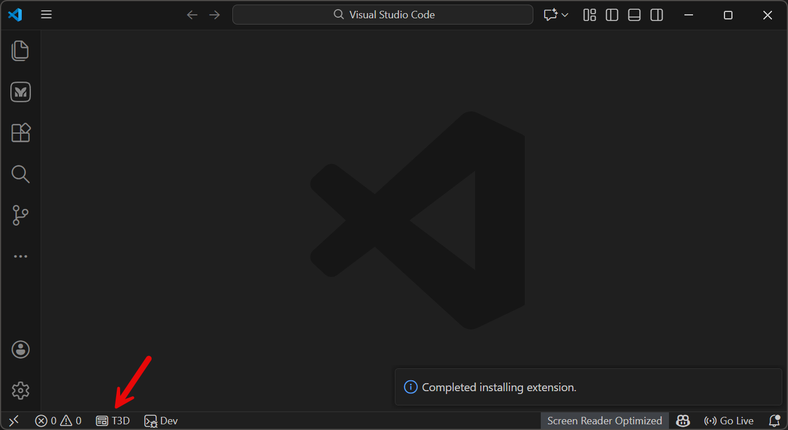
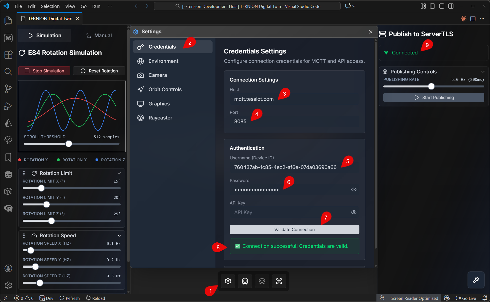

# M3 - Installation, Connectivity, and Setup Validation

## Introduction

จาก M1 ที่ปูพื้นแนวคิด และ M2 ที่ทำให้เห็นศักยภาพของแพลตฟอร์มในงานจริง บทนี้คือขั้นลงมือปฏิบัติ เพื่อให้ผู้เรียนติดตั้งระบบ เชื่อมต่ออุปกรณ์ และเชื่อมต่อคลาวด์ได้ครบในเส้นทางเดียว โดยเน้นทำตามได้ง่าย ชัดเจน และตรวจสอบผลได้ทุกช่วง

เนื้อหาเขียนใน **Education Tone** (ภาษาทางการแนวบทเรียนอาชีวศึกษา) แต่จัดวางเป็นขั้นตอนและภาพประกอบเป็นหลัก **ผู้เรียนที่ไม่คุ้นกับคำสั่งคอมพิวเตอร์ลึกยังทำตามได้** โดยอ่านทีละข้อและใช้ภาพหน้าจอประกอบ



ภาพนี้แสดงผลลัพธ์เป้าหมายของ M3 คือการตั้งค่า credentials และสถานะการเชื่อมต่อคลาวด์แบบปลอดภัยที่พร้อมใช้งานจริง

## Objective

- ติดตั้งและเปิดใช้งาน TESAIoT Digital Twin ให้พร้อมใช้งานจริง
- ตั้งค่าการเชื่อมต่อคลาวด์ให้ **ปลอดภัย** ด้วยมาตรฐานที่แพลตฟอร์มใช้ (MQTT ผ่าน TLS/WSS คือการส่งข้อมูลแบบเข้ารหัสที่นิยมในงาน IoT)
- ตั้งค่าข้อมูลยืนยันตัวตน (credentials) และตรวจสอบว่าการเชื่อมต่อทำงานแบบเรียลไทม์
- สรุปความพร้อมก่อนเริ่ม workshop หรือกรณีใช้งานจริงขั้นถัดไป

## Learning Outcomes

- ติดตั้งส่วนเสริม (extension) ได้ทั้งจาก Marketplace และจากไฟล์ VSIX
- ติดตั้งใบรับรอง CA ได้ถูกต้องตามระบบปฏิบัติการ (เพื่อให้เบราว์เซอร์และแพลตฟอร์มเชื่อถือการเชื่อมต่อแบบเข้ารหัส)
- ตั้งค่า MQTT และข้อมูลยืนยันตัวตน แล้ว**ตรวจสอบว่าการเชื่อมต่อสำเร็จ**
- แก้ปัญหาเบื้องต้นได้เมื่อมีข้อความแจ้งข้อผิดพลาดระหว่างการติดตั้ง

---

## Setup Overview

เพื่อให้เนื้อหาไม่กระโดด บทนี้แบ่งเป็น 4 ขั้นต่อเนื่อง:

1. **Step 1 - Install Extension**
2. **Step 2 - Install CA Certificate**
3. **Step 3 - Configure Credentials**
4. **Summary - พร้อมต่อยอดสู่การใช้งานจริง**

---

## Step 1: ติดตั้ง TESA Digital Twin Extension

### Prerequisites

ก่อนเริ่ม ให้ตรวจสอบว่าติดตั้ง Visual Studio Code หรือ IDE ที่พัฒนาบน VS Code แล้ว

### Method 1: ติดตั้งจาก Marketplace (แนะนำ)

1. **เปิดหน้า Extensions**  
   เปิด VS Code แล้วคลิกไอคอน **Extensions** ที่แถบด้านซ้าย (หรือกด `Ctrl+Shift+X` / `Cmd+Shift+X` บน macOS)
2. **ค้นหา Extension**  
   พิมพ์ `TERNION Digital Twin` ในช่องค้นหา แล้วรอผลลัพธ์
3. **ติดตั้ง Extension**  
   กดปุ่ม **Install** บนการ์ด **TERNION Digital Twin**



### Method 2: ติดตั้งจากไฟล์ VSIX

1. **เปิด Command Palette**  
   กด `Ctrl+Shift+P` (Windows/Linux) หรือ `Cmd+Shift+P` (macOS)
2. **เลือกคำสั่งติดตั้ง VSIX**  
   พิมพ์ `VSIX` แล้วเลือก **Extensions: Install from VSIX...**
3. **เลือกไฟล์ VSIX**  
   เลือกไฟล์ `.vsix` ที่ต้องการ (เช่น `ternion-digital-twin-1.0.0.vsix`) แล้วกด **Install**



### Verification

เมื่อติดตั้งสำเร็จ ให้ตรวจสอบว่า extension แสดงอยู่ในรายการที่ติดตั้ง และมีไอคอน **TESA Digital Twin** ที่มุมล่างซ้ายของหน้าต่าง VS Code



---

## Step 2: ติดตั้ง CA Certificate สำหรับการเชื่อมต่อปลอดภัย

TESA Digital Twin ใช้ MQTT over TLS/WSS เพื่อสื่อสารกับคลาวด์ ดังนั้นต้องติดตั้ง CA certificate ลง trust store ของระบบปฏิบัติการ เพื่อให้ Browser และ VS Code webview เชื่อถือการเชื่อมต่อ

### Why Install the CA Certificate?

- Browser เชื่อถือการเชื่อมต่อ WSS ได้อัตโนมัติ
- VS Code webview เชื่อมต่อ MQTT broker ผ่าน WSS ได้
- ลดปัญหา certificate error สำหรับ custom/internal CA

### Prerequisites

- ติดตั้ง TESA Digital Twin extension แล้ว
- มีสิทธิ์ administrator/sudo
- มีไฟล์ CA certificate (`.pem` หรือ `.crt`)
- มี Node.js 18+ (กรณีใช้วิธี CLI)

### Method 1: ติดตั้งด้วย T3D CLI (แนะนำ)

**Step 1: ติดตั้ง T3D CLI**

```bash
npm install -g @ternion/t3d
```

**Step 2: ติดตั้ง CA Certificate**

```bash
t3d ca install --cert <path-to-certificate-file>
```

ตัวอย่าง:

```bash
t3d ca install --cert path/to/ca-chain.pem
```

CLI จะตรวจระบบปฏิบัติการ ติดตั้ง certificate และอัปเดต trust store ให้โดยอัตโนมัติ

**Step 3: Verify Installation**

หลังรันคำสั่งสำเร็จ ควรเห็นข้อความยืนยันว่าติดตั้งเรียบร้อย

**Uninstalling the CA Certificate**

```bash
t3d ca uninstall --cert <path-to-certificate-file>
```

### Method 2: ติดตั้งแบบ Manual

#### Windows

**Option A: Certificate Manager (GUI)**

1. กด `Win + R` พิมพ์ `certmgr.msc` แล้วกด Enter
2. ไปที่ `Trusted Root Certification Authorities` -> `Certificates`
3. คลิกขวา `Certificates` -> `All Tasks` -> `Import`
4. เลือกไฟล์ `.pem` หรือ `.crt`
5. กด `Next` -> `Finish`
6. รีสตาร์ต Browser และ VS Code

**Option B: PowerShell (Administrator)**

```powershell
certutil -addstore -f Root "path\to\ca-chain.pem"
```

#### macOS

**Option A: Keychain Access (GUI)**

1. เปิด Keychain Access (Applications -> Utilities)
2. เลือก System keychain
3. ไปที่ `File` -> `Import Items...`
4. เลือกไฟล์ certificate
5. ดับเบิลคลิก certificate ที่นำเข้า
6. ตั้งค่า Trust เป็น "Always Trust"
7. บันทึกและใส่รหัสผ่าน admin
8. รีสตาร์ต Browser และ VS Code

**Option B: Command Line**

```bash
sudo security add-trusted-cert -d -r trustRoot -k /Library/Keychains/System.keychain /path/to/ca-chain.pem
```

#### Linux (Ubuntu/Debian)

1. คัดลอกไฟล์:

```bash
sudo cp ca-chain.pem /usr/local/share/ca-certificates/
```

2. อัปเดต trust store:

```bash
sudo update-ca-certificates
```

3. รีสตาร์ต Browser และ VS Code

หมายเหตุสำหรับ distro อื่น:

- Fedora/RHEL: `/etc/pki/ca-trust/source/anchors/` + `sudo update-ca-trust`
- Arch Linux: `/etc/ca-certificates/trust-source/anchors/` + `sudo trust extract-compat`

### Verification

1. ปิดและเปิด VS Code ใหม่
2. ปิดและเปิด Browser ใหม่
3. ทดสอบการเชื่อมต่อ MQTT broker ผ่าน TESA Digital Twin

### Troubleshooting

**Certificate ยังไม่ถูก trust?**

- รีสตาร์ต VS Code และ Browser แล้วหรือยัง
- ตรวจรูปแบบไฟล์ `.pem` หรือ `.crt`
- Windows ต้องรันแบบ Administrator
- macOS ต้องตั้ง "Always Trust"

**Permission error?**

- ตรวจสิทธิ์ administrator/sudo
- ใช้ PowerShell/Command Prompt แบบ Administrator หรือ `sudo`

---

## Step 3: Configure Credentials สำหรับ TESAIoT Digital Twin

หลังติดตั้ง CA certificate แล้ว ขั้นตอนต่อไปคือการตั้งค่า MQTT credentials เพื่อเชื่อมต่อคลาวด์และรับข้อมูลอุปกรณ์แบบเรียลไทม์

### Why Configure Credentials?

- เชื่อมต่อกับ MQTT broker บนคลาวด์แบบปลอดภัย
- ส่งและรับข้อมูลแบบเรียลไทม์จากอุปกรณ์ IoT
- ซิงก์การจำลอง Digital Twin กับข้อมูลจริง
- รองรับการสื่อสารสองทางระหว่างโมเดล 3D และบริการคลาวด์

### Prerequisites

- ติดตั้ง TESAIoT Digital Twin extension แล้ว
- ติดตั้ง CA certificate แล้ว (จาก Step 2)
- มีอุปกรณ์ใน Device Management ของแพลตฟอร์ม TESAIoT
- มีข้อมูล MQTT credentials:
  - **Username** (Device ID)
  - **Password**
  - **Host:** `mqtt.tesaiot.dev`
  - **Port:** `8085`

### Step-by-Step Instructions



> **หมายเหตุ:** สำหรับการตั้งค่าในบทเรียนนี้ ให้ใช้โดเมนแบบ `.dev` แทน `.com`

**Step 1: Open Settings**

1. คลิกปุ่ม **Settings** ที่ quick toolbar ด้านล่างของแผง TESAIoT Digital Twin

**Step 2: Access Credentials Settings**  
2. เลือกแผง **Credentials Settings** จากเมนู settings

**Step 3: Enter Connection Details**  
3. กรอก **Host** เป็น `mqtt.tesaiot.dev`  
4. กรอก **Port** เป็น `8085`  
5. กรอก **Username** (Device ID)  
6. กรอก **Password**

**Step 4: Validate Connection**  
7. กด **Validate Connection** เพื่อทดสอบการเชื่อมต่อ

**Step 5: Verify Success**  
8. หากสำเร็จ จะเห็นข้อความ **"Connection successful! Credentials are valid."**  
9. ตรวจสถานะ **`Connected`** ที่แผงด้านขวา

### Verification

1. สถานะการเชื่อมต่อขึ้น **`Connected`**
2. มีการอัปเดตข้อมูลแบบเรียลไทม์เมื่ออุปกรณ์ publish
3. สถานะการเชื่อมต่อคงที่ต่อเนื่อง

### Troubleshooting

**Connection Validation Failed?**

- ตรวจ Username/Password
- ตรวจว่าอุปกรณ์ถูกสร้างใน Device Management แล้ว
- ตรวจ Host = `mqtt.tesaiot.com` และ Port = `8085`
- ตรวจว่า CA certificate ติดตั้งแล้ว
- ตรวจอินเทอร์เน็ต

**Status Shows "Disconnected"?**

- กด Validate Connection อีกครั้ง
- ตรวจว่า credentials ไม่ถูกเปลี่ยน
- อัปเดต VS Code/extension
- รีสตาร์ต VS Code

**Certificate Errors?**

- ยืนยันว่าทำ Step 2 แล้ว
- รีสตาร์ต VS Code หลังติดตั้ง certificate
- ตรวจ trust store ของระบบ

---

## Step 4: Final Readiness Check

### Validation Checklist (Go/No-Go)

- [ ] ใช้งาน VS Code Extension ได้
- [ ] แสดงผลข้อมูลบน Digital Twin ได้ต่อเนื่อง
- [ ] เชื่อมต่อ Cloud ผ่าน MQTT over TLS/WSS สำเร็จ
- [ ] ส่งข้อมูลขึ้น Cloud และเห็นสถานะ publish ชัดเจน
- [ ] เห็นกราฟ/สถิติการสื่อสารเพื่อวิเคราะห์ประสิทธิภาพ

### Common Issues and Quick Fix

- **Cloud auth ไม่ผ่าน:** ตรวจ credential, endpoint, และ certificate
- **เชื่อมต่อ MQTT TLS/WSS ไม่สำเร็จ:** ตรวจ firewall/network และ protocol/port
- **ข้อมูล publish ไม่ต่อเนื่อง:** ตรวจ publish rate, network stability, และสถานะ session
- **MCP/LLM ไม่ตอบสนอง:** ตรวจ integration และ permission

---

## บทสรุปส่งท้าย

บท M3 ผูกสามชั้นของการทำงานเข้าด้วยกัน: แพลตฟอร์มพร้อมใช้งาน (ติดตั้ง Extension), ความไว้วางใจของการเชื่อมต่อ (CA Certificate สำหรับ MQTT over TLS/WSS), และความถูกต้องของตัวตนบนคลาวด์ (credentials ที่ตรงกับอุปกรณ์และนโยบายความปลอดภัย) เมื่อผ่านขั้นตอนเหล่านี้แล้ว ผู้เรียนจะย้อนกลับไปเชื่อมกับภาพใหญ่ใน M1 และ M2 ได้ชัดเจนขึ้น จากแนวคิด IoT Immersive / Digital Twin และความสามารถของ TESAIoT Digital Twin Platform สู่การลงมือจริงบนเครื่องของตนเองโดยไม่ต้องเขียนโค้ดในขั้นตั้งค่าเริ่มต้น

ขอให้ใช้รายการตรวจใน Step 4 เป็นเกณฑ์ยืนยันความพร้อมก่อนเข้าบทปฏิบัติหรือกิจกรรมถัดไป หากพบปัญหาให้ย้อนไล่ตามลำดับ Step 1 → 3 และทบทวนหมายเหตุเรื่องโดเมน/พอร์ตที่ใช้ในบทเรียน เพื่อให้การต่อยอดไปสู่การทดลอง use case ตามบทบาท (ผลิตภัณฑ์และธุรกิจ, เฟิร์มแวร์, โรงงาน, การศึกษา) เป็นไปอย่างต่อเนื่องและมั่นใจ

**ส่งต่อ M4:** บทถัดไปแนะนำการใช้ **Free Loader** เพื่อซิงค์ชุดทรัพยากร 3D ฟรีจาก GitHub เติมให้ฉากและแคตตาล็อกโมเดลพร้อมใช้งานโดยไม่ต้องจัดการไฟล์ภายนอกแพลตฟอร์ม
