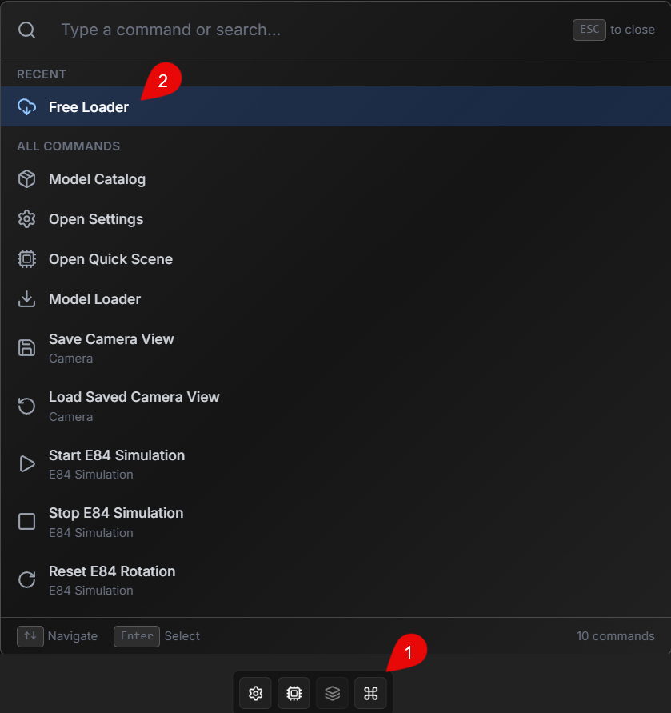
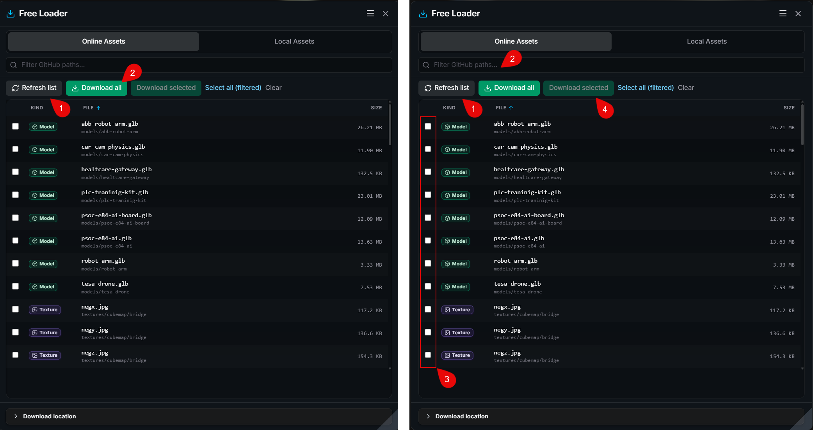
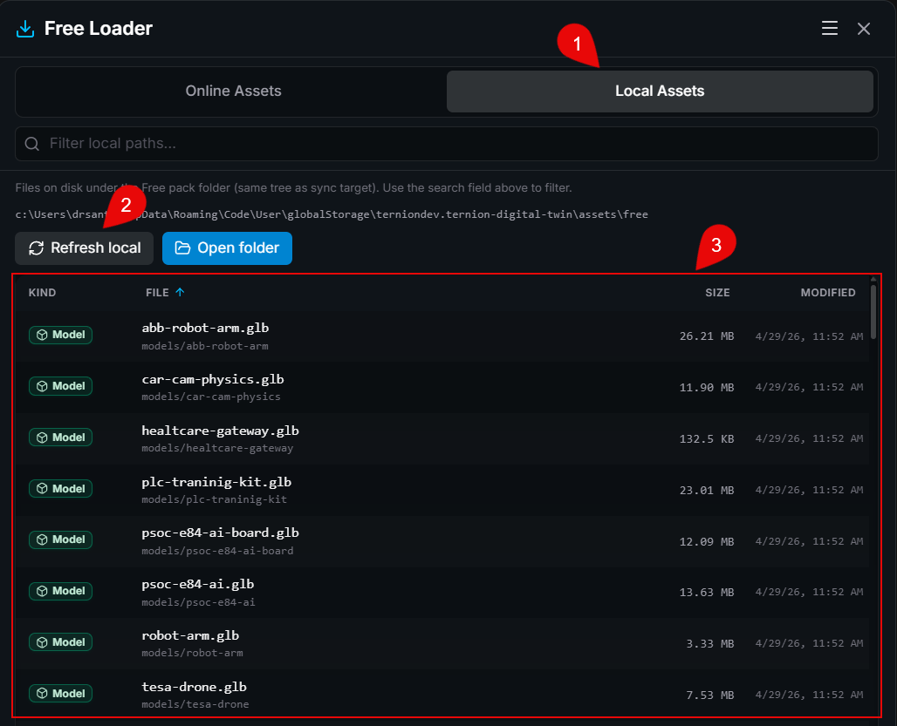
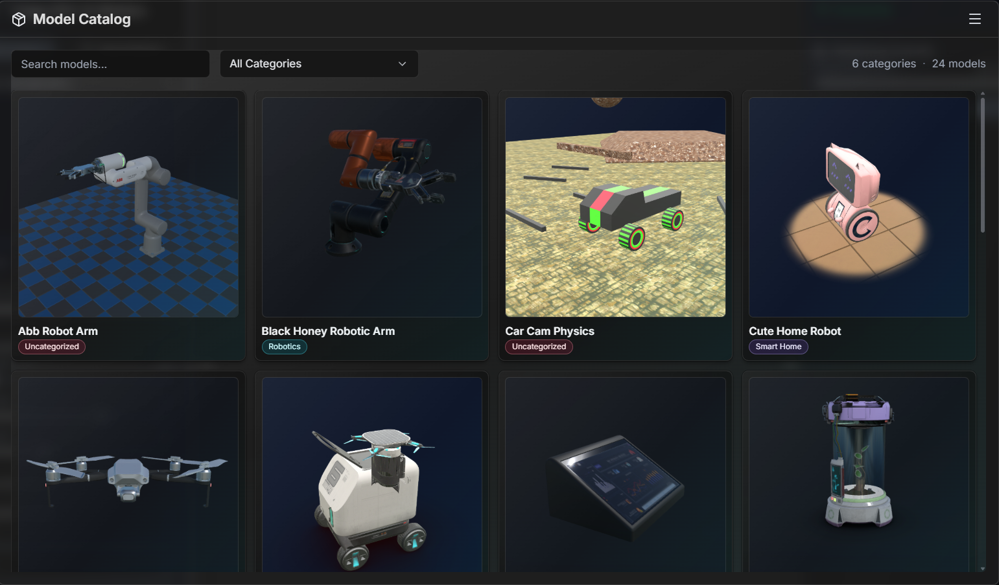

# M4 - Free Loader: ดึงชุดโมเดลและสื่อ 3D ฟรีเข้ามาใช้งานใน Digital Twin

## Introduction

หลัง M1 ที่ปูแนวคิด และ M2 ที่เห็นภาพการใช้งานจริง รวมถึง M3 ที่เตรียมระบบและการเชื่อมต่อจนพร้อมใช้งานแล้ว ขั้นถัดไปคือการเติมทรัพยากรให้ฉาก Digital Twin พร้อมสำหรับการสื่อสาร ทดสอบ และนำเสนอในงานจริง

**Free Loader** คือเครื่องมือสำเร็จรูปในแพลตฟอร์ม TESAIoT Digital Twin สำหรับ **ดึงชุดทรัพยากร 3D ฟรี** (โมเดล ภาพพื้นผิว และไฟล์ประกอบ) จากคลังออนไลน์ที่ทีมงานจัดเตรียมไว้ คุณมองเห็นรายการแบบออนไลน์ เปรียบเทียบกับของที่มีในเครื่องแล้ว และสั่งให้ระบบนำเข้าให้ครบตามที่เลือก เหมือนมีผู้ช่วยจัดชุดตัวอย่างให้พร้อมนำไปโชว์ลูกค้า สอนในชั้นเรียน หรือประกอบการทดลองกับข้อมูลจากบอร์ดและคลาวด์

เมื่อพูดถึงงานที่เกี่ยวกับ **AI, Machine Learning (ML), และ Edge AI** การมีฉากและวัตถุที่พร้อมใช้ช่วยให้ **เล่าเรื่องเป็นภาพ** ได้ชัดขึ้น ไม่ว่าจะเป็นการนำเสนอแนวคิด การสอน หรือการทดสอบสถานการณ์ก่อนลงมือทำฮาร์ดแวร์จริง

---

## ทำไมส่วนนี้ถึงสำคัญกับงานของคุณ

ซอฟต์แวร์ตัวนี้ช่วยให้คุณ **ประหยัดเวลา** และ **ลดความเสี่ยงว่าทีมจะใช้ไฟล์คนละชุดกัน** เพราะทุกคนดึงจากแหล่งเดียวกันผ่านปุ่มในแพลตฟอร์มเดียวกัน

- **นักพัฒนาผลิตภัณฑ์ / โปรดักต์:** ทำต้นแบบและเดโมได้เร็ว เปลี่ยนฉากให้สอดคล้องกับเรื่องที่จะเล่าให้ทีมหรือผู้มีส่วนได้ส่วนเสียได้ทันที
- **นักธุรกิจและการตลาด:** นำเสนอมุมมอง 3D ที่ดูเป็นมืออาชีพโดยไม่ต้องพึ่งทีมกราฟิกทุกครั้งที่ต้องการตัวอย่างใหม่
- **ครู อาจารย์ และนักศึกษา:** ใช้ชุดตัวอย่างเดียวกันในห้องเรียน ลดปัญหา “เครื่องนี้มีไฟล์ เครื่องนั้นไม่มี”
- **ผู้พัฒนาระบบสมองกลฝังตัว:** มีฉากและวัตถุพร้อมสำหรับผูกกับข้อมูลจริงจากอุปกรณ์และคลาวด์ โดยโฟกัสที่การทดสอบพฤติกรรม ไม่ใช่การไล่หาไฟล์กระจาย

---

## Objective

- เข้าใจว่า **Free Loader** ช่วยอะไรในงานประจำวัน และต่างจาก **Model Loader** (แหล่งทรัพยากรอื่น) อย่างไรในเชิงการใช้งาน
- ใช้ Free Loader จนจบขั้นตอน: ดูรายการออนไลน์ → เลือกสิ่งที่ต้องการ → นำเข้า → ตรวจในเครื่อง
- รู้ว่าหลังนำเข้าแล้วจะไปต่อกับ **แคตตาล็อกโมเดลหรือฉากในแพลตฟอร์ม** ได้อย่างไรในระดับภาพรวม

## Learning Outcomes

หลังอ่านและลองทำตาม คุณจะสามารถ:

- เปิด Free Loader จากคำสั่งในแพลตฟอร์ม และสลับระหว่างมุมมอง **ออนไลน์** กับ **ในเครื่อง** ได้
- ค้นหาและเลือกชุดทรัพยากรที่ต้องการ แล้วให้ระบบนำเข้า พร้อมดูความคืบหน้าแบบเข้าใจง่าย
- ตรวจสอบว่าไฟล์มาอยู่ตรงที่คาดหรือไม่ และนำไปใช้ต่อในขั้นถัดไปได้อย่างมั่นใจ

---

## Free Loader กับ Model Loader (สั้น ๆ ไม่สับสน)

|                | **Free Loader**                                                              | **Model Loader**                                                                                                           |
| -------------- | ---------------------------------------------------------------------------- | -------------------------------------------------------------------------------------------------------------------------- |
| **เหมาะเมื่อ** | ต้องการ **ชุดทรัพยากรฟรีมาตรฐาน** ที่แพลตฟอร์มเชื่อมกับคลังออนไลน์ไว้ให้แล้ว | ต้องการดึงทรัพยากรจากแหล่งที่ต้องได้รับ **การอนุญาตเข้าถึง** (เช่น ร้านโมเดลหรือบริการที่ลงทะเบียนและได้สิทธิ์ตามเงื่อนไข) |
| **ภาพในใจ**    | เหมือนกด “รับชุดตัวอย่างฟรี” ที่จัดหมวดมาให้                                 | เหมือน “ขอใช้แพ็กตามสิทธิ์ที่ได้รับ” หลังผ่านการอนุญาตจากแหล่งนั้น                                                         |

**Model Loader** เป็นเครื่องมืออีกตัวที่ทำหน้าที่ใกล้เคียงกัน คือช่วยนำโมเดลและทรัพยากรที่เกี่ยวข้องเข้ามาในงาน แต่แหล่งข้อมูลมักเป็นแหล่งที่ **จำเป็นต้องได้รับการอนุญาตในการเข้าถึง** ตามนโยบายขององค์กรหรือผู้ให้บริการ บทเรียนจึงแยกเรื่องนี้ไว้ใน **โมดูลถัดไป** เพื่ออธิบายขั้นตอน การขอสิทธิ์ และการใช้งาน Model Loader ให้ครบในลำดับถัดไป

บทนี้โฟกัสที่ **Free Loader** เพื่อให้ทุกคนทำตามได้หมด ไม่จำเป็นต้องมีพื้นฐานโปรแกรมเมอร์

---

## แพลตฟอร์มทำอะไรให้คุณอัตโนมัติ

คุณไม่จำเป็นต้องรู้ว่าด้านหลังระบบจัดเก็บไฟล์อย่างไร สิ่งที่ควรรู้คือ **คุณได้รับอะไร**:

1. **รายการชัดเจน:** เห็นว่ามีโมเดลและไฟล์ประกอบอะไรบ้าง พร้อมค้นหาเมื่อรายการยาว
2. **เลือกได้ยืดหยุ่น:** เอาทั้งชุดหรือเฉพาะส่วนที่สนใจ
3. **นำเข้าอย่างเป็นระเบียบ:** มีแถบแสดงความคืบหน้า และแจ้งเมื่อเสร็จ
4. **ต่อกับการใช้งานถัดไป:** พอนำเข้าแล้ว มุมมองโมเดลในแพลตฟอร์ม (เช่นแคตตาล็อก) จะสะท้อนของใหม่ให้คุณไปเลือกใช้ต่อได้

---

## ใช้งานผ่าน VS Code หรือเว็บเบราว์เซอร์ (รวมมือถือและแท็บเล็ต)

แพลตฟอร์มออกแบบให้ใช้ได้หลายช่องทาง โดยหลักการง่าย ๆ คือ:

- **ในแอปหลัก (VS Code Extension):** การนำเข้ามักทำงานลื่นที่สุด เพราะแอปช่วยจัดการที่เก็บไฟล์ให้ตามที่ออกแบบไว้ คุณอาจเปิดโฟลเดอร์ปลายทางจากเมนูในแพลตฟอร์มได้โดยตรง
- **ผ่านเว็บเบราว์เซอร์:** สะดวกเวลานำเสนอหรือเรียนรู้นอกโต๊ะทำงาน หากฟังก์ชันนำเข้าไม่แสดงหรือไม่สมบูรณ์ ให้ใช้ช่องทางหลักใน VS Code ตามที่ทีมงานแนะนำ หรือติดตามคำแนะนำในหน้าจอ **โดยไม่จำเป็นต้องแก้ไขระบบเอง**

ถ้ามีข้อความแจ้งว่ารายการโหลดไม่สำเร็จชั่วคราว ให้ลองใหม่ภายหลัง หรือปรึกษาผู้ดูแล IT / ทีมสนับสนุนตามองค์กร ในฐานะผู้ใช้ทั่วไปไม่จำเป็นต้องเข้าใจคำศัพท์ทางเทคนิคลึกเพื่อใช้งานแพลตฟอร์ม

---

## ขั้นตอนใช้งาน Free Loader

### 1) เปิด Free Loader

1. เปิดเมนู **คำสั่งด่วน** (Quick Action) ของแพลตฟอร์ม ซึ่งมักเป็นไอคอนหรือปุ่มที่รวมคำสั่งยอดนิยมไว้ที่เดียว
2. เลือกรายการที่ชื่อใกล้เคียง **Free Loader** หรือมีคำว่า “ฟรี” “ทรัพยากร” “นำเข้า” ตามที่แสดงบนเวอร์ชันของคุณ

### 2) ดาวน์โหลดจากรายการออนไลน์

**กรณีต้องการโหลดทั้งหมดในครั้งเดียว**

1. กดปุ่มรีเฟรชรายการ เพื่อให้เห็นข้อมูลล่าสุด
2. กดปุ่ม **Download All**

**กรณีต้องการโหลดเฉพาะไฟล์ที่เลือก**

1. กดปุ่มรีเฟรชรายการเพื่อให้เห็นข้อมูลล่าสุด
2. พิมพ์ในช่องค้นหาเพื่อหาโมเดลหรือโฟลเดอร์ที่สนใจ
3. เลือกรายการที่ต้องการ (เลือกได้หลายรายการถ้าหน้าจอรองรับ)
4. กดปุ่ม **Download Selected**

เมื่อกดดาวน์โหลดแล้ว ให้รอจนแถบความคืบหน้าทำงานเสร็จ และตรวจข้อความยืนยันผลบนหน้าจอ

### 3) ตรวจสอบไฟล์ที่อยู่ในเครื่อง

1. สลับไปแท็บ **Local Assets**
2. กดปุ่ม **Refresh Local**
3. ตรวจสอบรายการไฟล์ว่าตรงกับที่เลือกดาวน์โหลด

### 4) หลังนำเข้า: ไปต่อยังไง

เมื่อขั้นตอนดาวน์โหลดสำเร็จ ให้เปิด **Model Catalog** เพื่อตรวจสอบว่าไฟล์เข้าระบบครบตามที่เลือก และทดลองจัดวางโมเดลกับฉากที่ต้องการใช้งานจริง เนื้อหาเชิงลึกของ Model Catalog จะอธิบายในโมดูลถัดไป

## ข้อความทิ้งท้าย

เมื่อจบ M4 คุณจะมีทรัพยากร 3D พร้อมใช้งานสำหรับการสื่อสาร ทดสอบ และนำเสนอในงานจริง และในโมดูลถัดไปเราจะพาไปต่อกับ **Model Loader** ซึ่งเป็นเครื่องมือที่คล้ายกัน แต่ต้องได้รับการอนุญาตเข้าถึงก่อนใช้งาน
