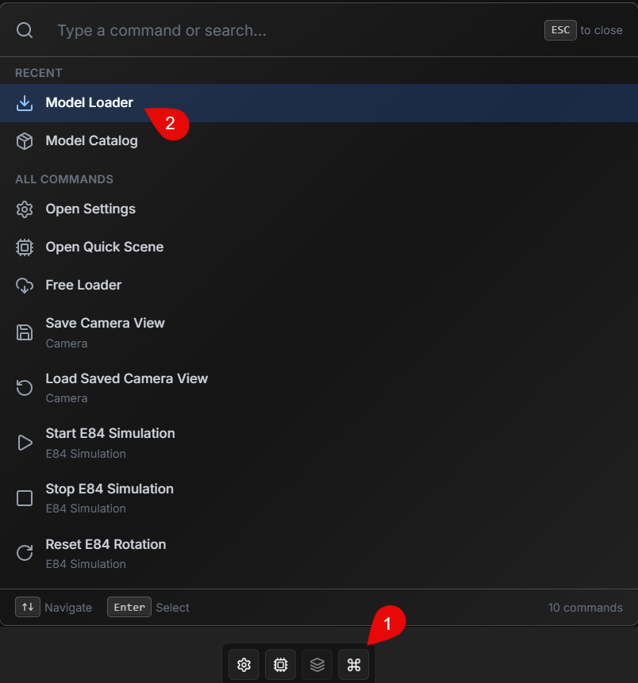
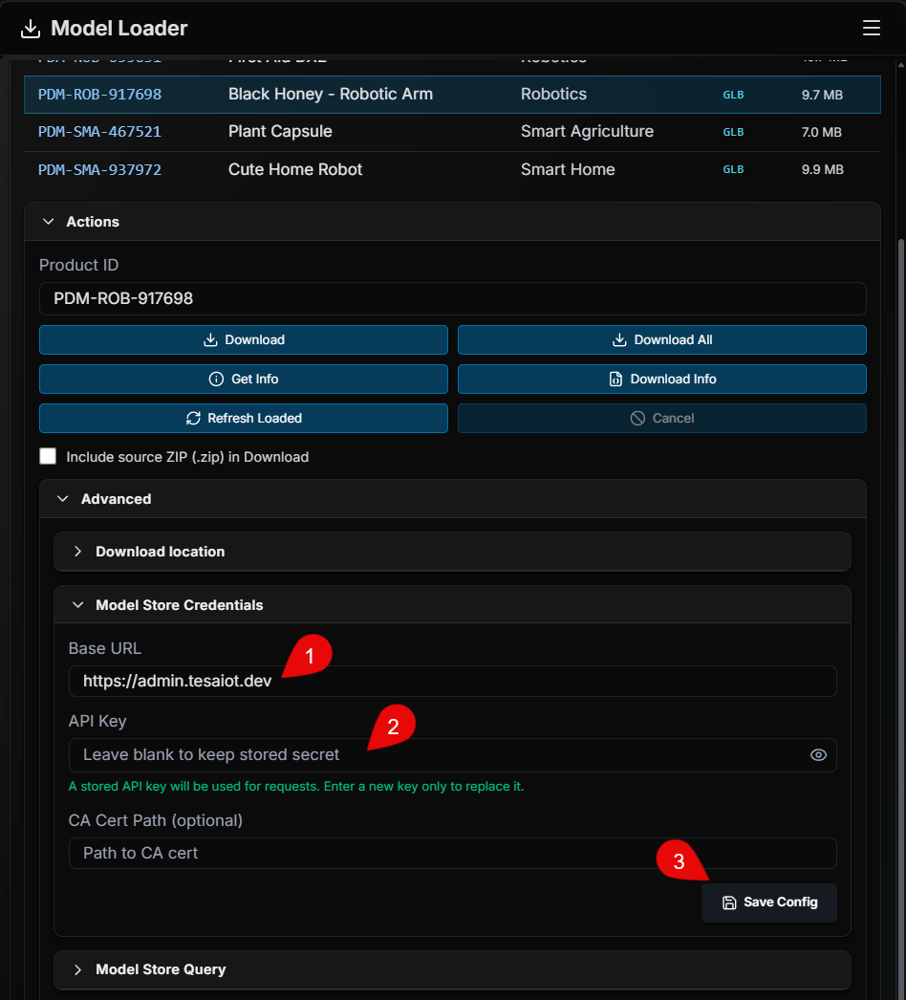
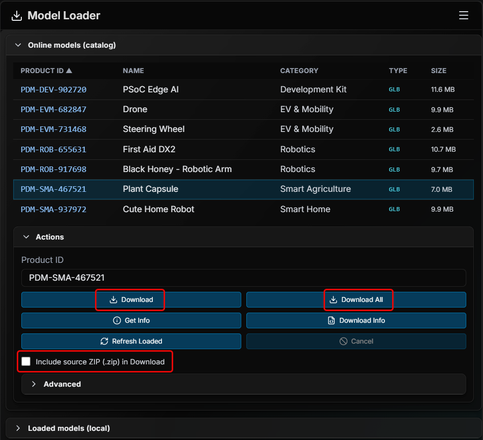
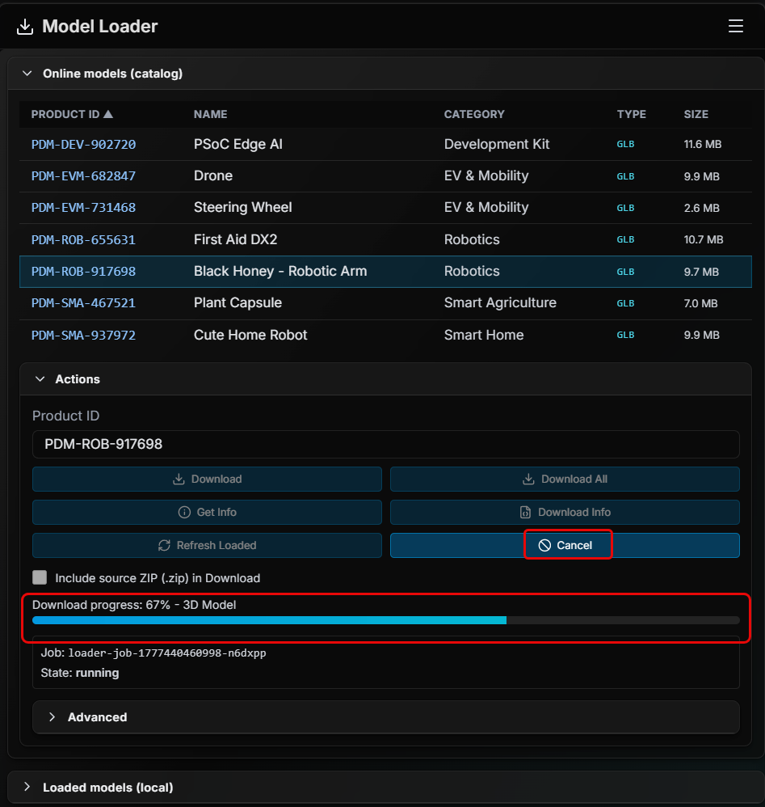
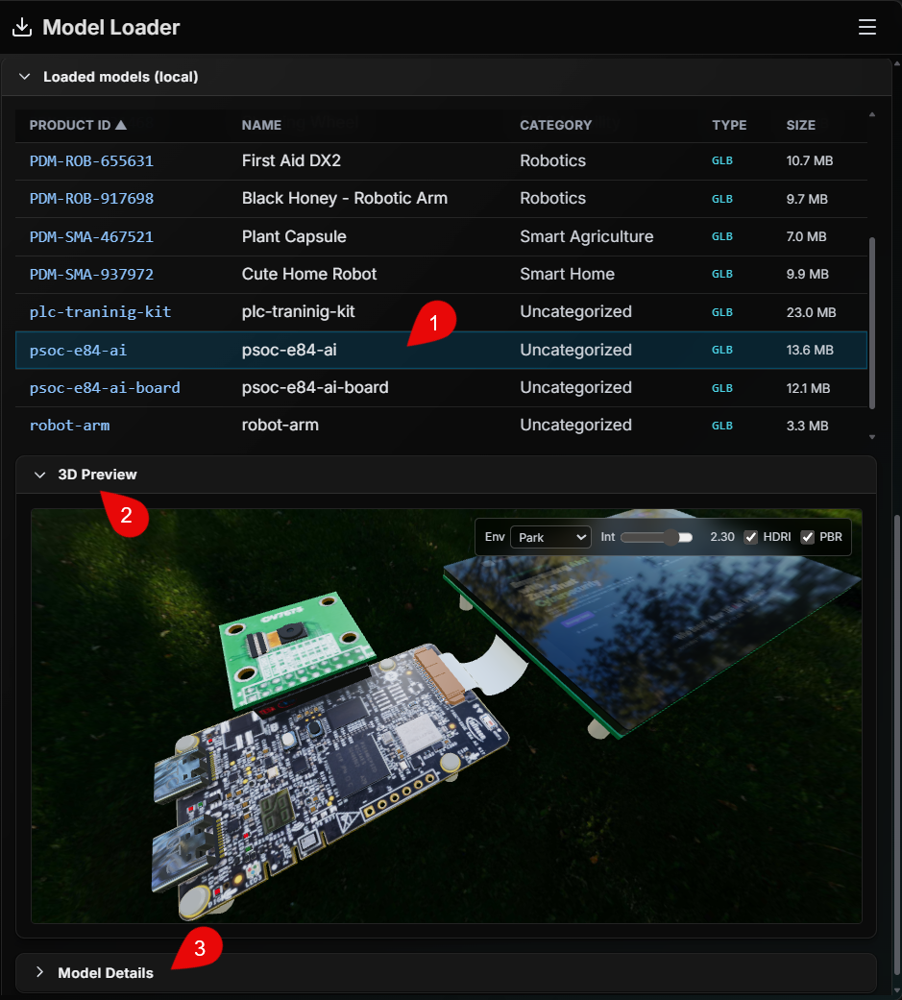

# M5 - Model Loader: นำเข้าโมเดลจาก TESAIoT Product Store

## Introduction

หลัง M4 ที่เราใช้ Free Loader เพื่อเติมทรัพยากรฟรีให้ฉาก Digital Twin ได้อย่างรวดเร็ว บทนี้จะต่อยอดไปยัง **Model Loader** สำหรับกรณีที่องค์กรหรือผู้ให้บริการกำหนดสิทธิ์การเข้าถึงไว้

Model Loader เป็นเครื่องมือสำเร็จรูปในแพลตฟอร์ม TESAIoT Digital Twin สำหรับค้นหา เลือก และดาวน์โหลดโมเดลจากแหล่งที่มีเงื่อนไขสิทธิ์ โดยผู้ใช้ยังทำงานผ่านหน้าจอเดียวแบบเป็นขั้นตอน ไม่ต้องเขียนโปรแกรม

ในงานจริง เครื่องมือนี้ช่วยให้ทีมเดินงานต่อจาก M1, M2, M3 และ M4 ได้ครบลูปมากขึ้น เพราะคุณสามารถเลือกโมเดลที่ตรงโจทย์ธุรกิจ การสอน หรือการทดลองกับข้อมูลจากอุปกรณ์และคลาวด์ แล้วนำไปใช้ในฉากได้ทันที

---

## ทำไมบทนี้จึงสำคัญ

- **ผลิตภัณฑ์และธุรกิจ:** เข้าถึงโมเดลที่ตรงกับบริบทสินค้าและเดโมได้แม่นยำขึ้น ไม่ต้องพึ่งเฉพาะชุดตัวอย่างทั่วไป
- **การตลาดและงานพรีเซนต์:** คัดเลือกทรัพยากรที่สื่อคุณค่าของโซลูชันได้ตรงกลุ่มลูกค้า
- **ครู อาจารย์ และนักศึกษา:** จัดบทเรียนให้ใช้โมเดลชุดเดียวกับที่ได้รับสิทธิ์ในสถาบัน ลดความคลาดเคลื่อนระหว่างเครื่อง
- **ผู้พัฒนาระบบสมองกลฝังตัว:** ทดสอบพฤติกรรมอุปกรณ์กับฉากที่ใกล้โจทย์จริงมากขึ้น ทั้งฝั่งอุปกรณ์และคลาวด์

---

## Objective

- เข้าใจบทบาทของ Model Loader และความแตกต่างจาก Free Loader ในเรื่องสิทธิ์การเข้าถึง
- ตั้งค่าและบันทึกข้อมูลสำหรับเข้าถึงแหล่งโมเดลได้อย่างถูกต้อง
- ค้นหา ดูข้อมูล และดาวน์โหลดโมเดลแบบทีละรายการหรือหลายรายการตามต้องการ
- ตรวจสอบผลลัพธ์หลังดาวน์โหลด และส่งต่อไปยังขั้นตอนใช้งานฉากได้อย่างมั่นใจ

## Learning Outcomes

หลังอ่านและลองทำตาม คุณจะสามารถ:

- เปิด Model Loader และตั้งค่า `Base URL`, `API Key`, `CA Cert Path` ได้เหมาะกับสภาพแวดล้อม
- ใช้คำสั่ง `List Models`, ค้นหา, กรองหมวดหมู่, และดูรายละเอียดโมเดลก่อนดาวน์โหลด
- ใช้คำสั่ง `Download`, `Download All`, `Download Info` และติดตามความคืบหน้าได้
- รับมือปัญหาเบื้องต้น เช่น สิทธิ์ไม่ผ่าน (401/403), รายการไม่ขึ้น, หรือการเชื่อมต่อสะดุด

---

## Free Loader กับ Model Loader (ภาพรวมสั้น ๆ)

|                 | **Free Loader**                   | **Model Loader**                               |
| --------------- | --------------------------------- | ---------------------------------------------- |
| **แหล่งข้อมูล** | คลังฟรีที่เชื่อมไว้ให้ทันที       | แหล่งที่ต้องได้รับสิทธิ์หรือการอนุญาต          |
| **การเริ่มต้น** | เริ่มใช้งานได้เร็ว เน้นชุดมาตรฐาน | ต้องตั้งค่าการเข้าถึงก่อน เช่น URL และ API Key |
| **เหมาะเมื่อ**  | ต้องการเริ่มฉากไวและใช้งานทั่วไป  | ต้องการโมเดลเฉพาะทางตามสิทธิ์ขององค์กร         |

---

## ก่อนเริ่มใช้งาน Model Loader

เพื่อให้ใช้งานได้ลื่น ควรเตรียมข้อมูลต่อไปนี้ให้พร้อม:

1. **Base URL** ของระบบที่ให้บริการ Model Loader เช่น `https://admin.tesaiot.dev`
2. **API Key** ที่ได้รับสิทธิ์ใช้งานแล้ว

หมายเหตุ:

- ถ้าระบบแจ้งสิทธิ์ไม่ผ่าน (เช่น 401 หรือ 403) มักเกิดจาก API Key ไม่ถูกต้อง หมดอายุ หรือยังไม่ได้รับสิทธิ์สำหรับแหล่งนั้น
- ในโหมดเบราว์เซอร์ ถ้าการเชื่อมต่อไม่ขึ้น ให้ตรวจว่า bridge ของ Model Loader ทำงานอยู่ก่อน

---

## ขั้นตอนใช้งาน Model Loader

### 1) เปิด Model Loader

1. เปิดเมนู **Quick Action**
2. เลือกคำสั่ง **Model Loader**

### 2) ตั้งค่าและบันทึกการเข้าถึง

1. กรอก `Base URL`
2. กรอก `API Key`
3. กรอก `CA Cert Path` เฉพาะกรณีที่สภาพแวดล้อมของคุณต้องใช้
4. กด **Save Config**

**สิ่งที่ควรรู้:**

- ใน VS Code ถ้าเคยบันทึกคีย์ไว้แล้ว คุณสามารถเว้นช่อง API Key ว่างเพื่อใช้ค่าที่เก็บไว้อยู่
- หากต้องการเปลี่ยนคีย์ ให้กรอกคีย์ใหม่แล้วกด Save อีกครั้ง

### 3) ค้นหาและเลือกรายการโมเดล

ก่อนดาวน์โหลด ให้ดึงรายการโมเดลและเลือกรายการที่ต้องการก่อน

1. กด **List Models** เพื่อดึงรายการจาก Product Store
2. ใช้ช่องค้นหาและตัวกรองหมวดหมู่เพื่อลดรายการให้ตรงกับงาน
3. คลิกเลือกโมเดลที่ต้องการในตาราง

### 4) ดาวน์โหลดโมเดล

คุณสามารถเลือกได้ 2 แบบ:

- **Download:** ดาวน์โหลดโมเดลที่เลือกจากรายการในตาราง
- **Download All:** ดาวน์โหลดทุกรายการที่แสดงอยู่ในตาราง

ตัวเลือกเสริม

- ติ๊ก **Include source ZIP (.zip)** เมื่อต้องการให้ระบบดาวน์โหลดไฟล์ ZIP ต้นฉบับเพิ่ม

**ระหว่างดาวน์โหลด:**

- ดูแถบ **Download progress**
- ถ้าจำเป็นสามารถกด **Cancel** เพื่อหยุดงานได้

### 5) ตรวจสอบโมเดลหลังดาวน์โหลด

1. คลิกเลือกโมเดลที่ต้องการในตาราง Local/Loaded Models
2. ดูผลในหน้าต่าง **3D Preview** เพื่อยืนยันว่าพร้อมใช้งาน
3. ตรวจรายละเอียดเพิ่มเติมจากส่วน **Model Details** และข้อมูลประกอบ

---

## ปัญหาที่พบบ่อยและวิธีแก้เบื้องต้น

- **API Key ถูกปฏิเสธ (401/403):** ตรวจคีย์อีกครั้ง แล้วกด Save Config
- **List Models ไม่ขึ้น:** ตรวจ Base URL, สิทธิ์, และสถานะเครือข่าย
- **โหมดเบราว์เซอร์เชื่อมต่อไม่ได้:** ตรวจว่า Model Loader bridge ทำงานอยู่
- **ดาวน์โหลดค้างหรือช้า:** รอความคืบหน้าอีกช่วงหนึ่งก่อน หรือยกเลิกแล้วเริ่มใหม่
- **ไม่เห็นไฟล์หลังดาวน์โหลด:** กด Refresh Loaded แล้วตรวจโฟลเดอร์ปลายทางอีกครั้ง

---

## ข้อความทิ้งท้าย

เมื่อจบ M5 คุณจะสามารถใช้งาน Model Loader ได้ตั้งแต่การตั้งค่าสิทธิ์ไปจนถึงการดาวน์โหลดและตรวจผล ทำให้การต่อยอดจาก M4 พร้อมใช้งานจริงมากขึ้น ทั้งในมุมธุรกิจ การสอน และการทดลองระบบในบริบท AIoT
