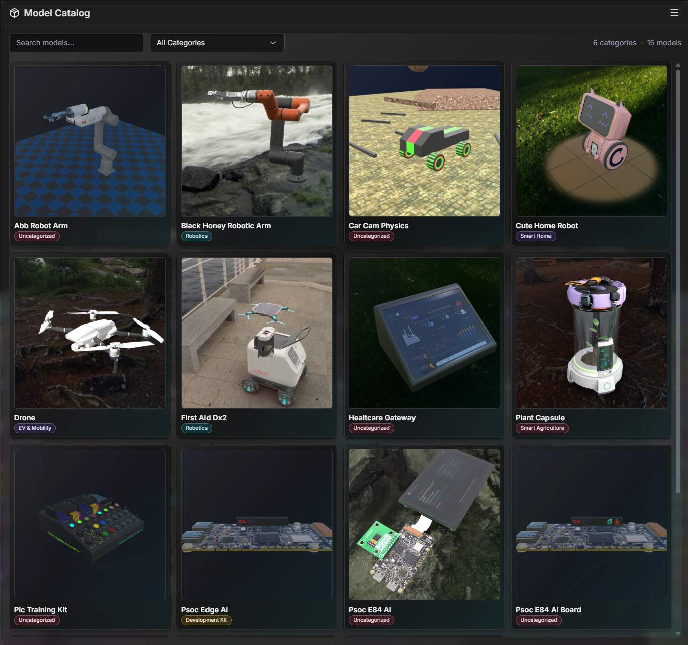
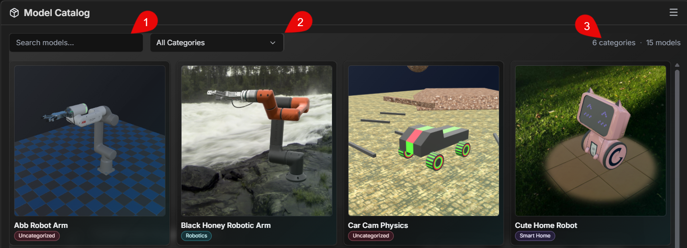
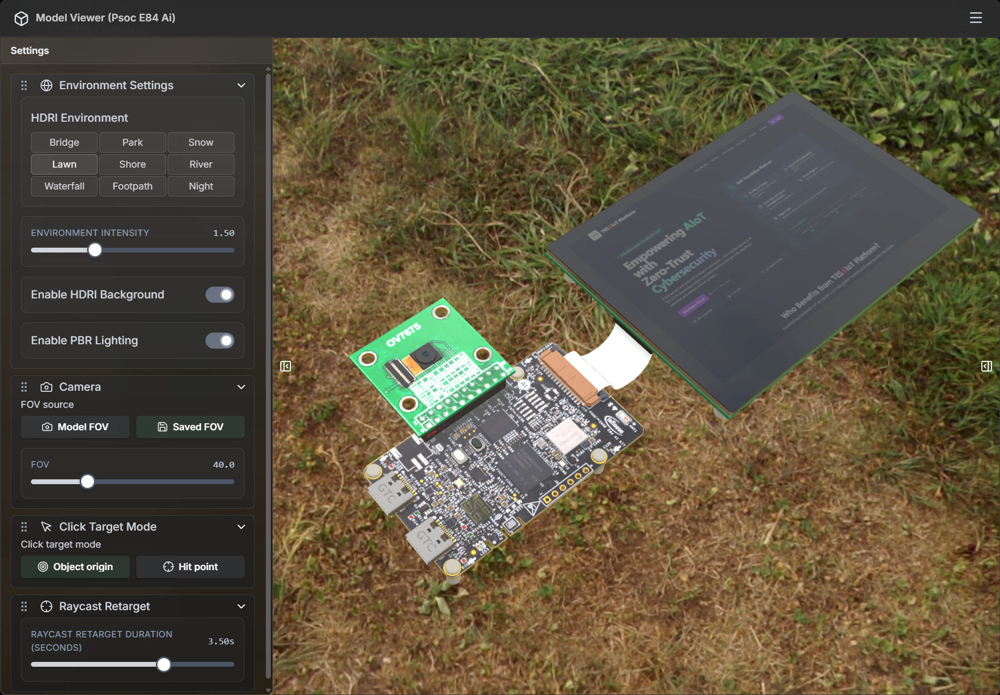

# M6 - Model Catalog and Thumbnail Creator: จัดการและพรีวิวโมเดลในคลังอย่างเป็นระบบ

## Introduction

หลังจาก M1 ปูพื้นแนวคิด, M2 แนะนำแพลตฟอร์ม, M3 เตรียมสภาพแวดล้อม, M4 นำเข้าทรัพยากรฟรี และ M5 ใช้งานทรัพยากรที่มีเงื่อนไขสิทธิ์แล้ว บทนี้จะพาไปยังขั้นถัดไปที่ทำให้งานครบวงจรมากขึ้น คือ **Model Catalog**

Model Catalog คือหน้ารวมโมเดลสำหรับค้นหา ตรวจสอบ และพรีวิวก่อนนำไปใช้ในฉากจริง โดยรวมทั้งโมเดลที่มากับระบบและโมเดลที่ผู้ใช้ดาวน์โหลดเพิ่มไว้ในที่เดียว ทำให้ทีมผลิตภัณฑ์ ธุรกิจ การตลาด การสอน และงานระบบฝังตัวอ้างอิงข้อมูลภาพชุดเดียวกันได้ง่ายขึ้น

---

## ทำไมบทนี้จึงสำคัญ

- **รวมศูนย์การตัดสินใจ:** เห็นรายการโมเดลในที่เดียวก่อนเลือกใช้จริง
- **ลดความผิดพลาดในการเลือกไฟล์:** มีพรีวิวและข้อมูลประกอบก่อนนำไปใช้
- **ทำงานข้ามทีมง่ายขึ้น:** ทีมต่างบทบาทอ้างอิงโมเดลชุดเดียวกันได้ชัดเจน
- **เพิ่มความเร็วในการนำเสนอ:** เลือกโมเดลที่เหมาะกับเดโมได้เร็ว ไม่ต้องค้นหลายที่

---

## Objective

- เข้าใจบทบาทของ Model Catalog ในฐานะศูนย์รวมโมเดลจากหลายแหล่ง
- ค้นหาและกรองโมเดลตามชื่อและหมวดหมู่ได้อย่างมั่นใจ
- เปิดพรีวิวเพื่อตรวจคุณภาพและความเหมาะสมของโมเดลก่อนใช้งาน
- เตรียมโมเดลที่เลือกไว้สำหรับขั้นตอนฉากหรือกิจกรรมถัดไป

## Learning Outcomes

หลังจบบทนี้ คุณจะสามารถ:

- เปิด Model Catalog จาก Quick Action ได้
- ค้นหาโมเดลด้วยช่อง Search และตัวกรอง Category ได้ตรงความต้องการ
- แยกภาพรวมโมเดลที่มีอยู่เดิมกับโมเดลที่ดาวน์โหลดเพิ่มได้
- ใช้ 3D Preview เพื่อตรวจโมเดลก่อนส่งต่อไปใช้งานจริง

---

## Model Catalog ทำงานร่วมกับ M4 และ M5 อย่างไร

| แหล่งโมเดล            | มาจากไหน                                    | ใช้ใน Model Catalog อย่างไร               |
| --------------------- | ------------------------------------------- | ----------------------------------------- |
| **Packaged models**   | โมเดลที่มากับแพลตฟอร์ม                      | แสดงเป็นรายการพร้อมใช้งานทันที            |
| **Downloaded models** | โมเดลที่โหลดผ่าน Free Loader / Model Loader | ถูกรวมเข้าคลังเดียวกันเพื่อค้นหาและพรีวิว |

สรุปง่าย ๆ คือ M4 และ M5 เป็นขั้นตอน “นำโมเดลเข้าระบบ” ส่วน M6 คือขั้นตอน “คัดเลือกและตรวจโมเดลก่อนใช้งาน”

---

## ก่อนเริ่มใช้งาน Model Catalog

1. ควรมีโมเดลอยู่ในระบบอย่างน้อยหนึ่งชุด (จาก M4 หรือ M5)
2. ถ้าใช้งานผ่านเบราว์เซอร์และไม่เห็นโมเดลที่โหลดใหม่ ให้ตรวจการเชื่อมต่อ Bridge แล้วรีเฟรช
3. หากรายการยังไม่อัปเดต ให้ลองเปิดปิดหน้าต่าง Model Catalog ใหม่อีกครั้ง

---

## ขั้นตอนใช้งาน Model Catalog

วิดีโอสาธิตสำหรับทำตามทีละขั้น: [Model Catalog Demo (M6)](https://youtu.be/staK480xsiI)

### 1) เปิด Model Catalog

1. เปิดเมนู **Quick Action**
2. เลือกคำสั่ง **Model Catalog**
3. ตรวจว่าหน้าต่างแคตตาล็อกแสดงรายการโมเดล และพร้อมใช้งานก่อนเข้าสู่ขั้นถัดไป

### 2) ค้นหาและกรองรายการ

1. ใช้ช่อง **Search models** เพื่อค้นหาตามชื่อ
2. ใช้ตัวกรอง **All Categories / Category** เพื่อแยกกลุ่มที่สนใจ
3. ดูจำนวนหมวดหมู่และจำนวนโมเดลที่แสดง เพื่อยืนยันว่ากรองถูกต้อง

### 3) เลือกโมเดลจากรายการ

1. คลิกที่การ์ดหรือแถวของโมเดลที่ต้องการตรวจสอบ
2. ตรวจชื่อและหมวดหมู่ให้ตรงกับบริบทงานก่อนเปิดพรีวิว
3. หากกำลังเปรียบเทียบหลายตัว ให้เลือกทีละโมเดลเพื่อดูความแตกต่างได้ชัดเจน

### 4) เปิด 3D Preview เพื่อตรวจความพร้อมของโมเดล

เมื่อคลิกที่ Thumbnail จะมีหน้าต่าง **Model Preview** ปรากฏขึ้น โดยแผงควบคุมด้านซ้ายมีตัวเลือกสำหรับปรับมุมมองและรายละเอียดต่าง ๆ เพื่อยืนยันว่าโมเดลเหมาะสมกับงานที่จะนำไปใช้

---

## ปัญหาที่พบบ่อยและวิธีแก้เบื้องต้น

- **ไม่เห็นโมเดลที่เพิ่งดาวน์โหลด:** รีเฟรชรายการ หรือเปิดหน้าต่าง Model Catalog ใหม่
- **ในโหมดเบราว์เซอร์รายการไม่ครบ:** ตรวจว่า bridge ทำงานอยู่และเชื่อมต่อได้
- **พรีวิวบางโมเดลไม่ขึ้น:** ลองเปิดใหม่หรือทดสอบโมเดลอื่นก่อน แล้วค่อยกลับมา
- **ค้นหาแล้วไม่พบรายการ:** ตรวจคำค้น ตัวสะกด และตัวกรองหมวดหมู่

---

## ข้อความทิ้งท้าย

เมื่อจบ M6 คุณจะใช้ Model Catalog เป็นจุดกลางในการคัดเลือกและตรวจโมเดลก่อนใช้งานจริงได้อย่างมั่นใจ ทำให้การต่อยอดจาก M4 และ M5 เป็นขั้นตอนที่เป็นระบบและพร้อมใช้งานมากขึ้นในงานธุรกิจ การสอน และงาน AIoT ภาคปฏิบัติ
