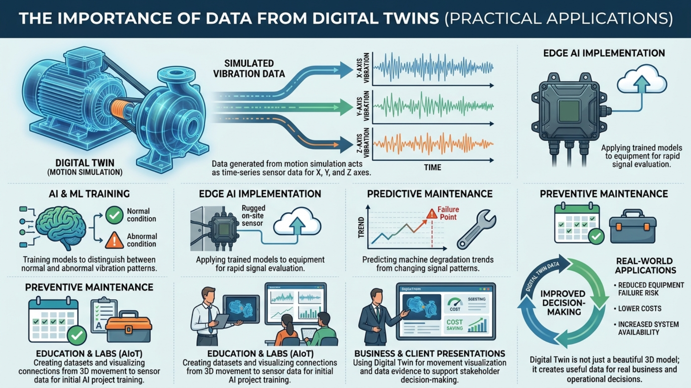

# M7 - 3D Object Motion Simulation (Auto & Manual Modes): ทดสอบการเคลื่อนไหวแบบอัตโนมัติและแบบหมุนด้วยมือ

## Introduction

หลังจาก M6 ที่เราใช้ Model Catalog เพื่อคัดเลือกโมเดลได้อย่างมั่นใจ บทนี้จะพาเข้าสู่การใช้งานเชิงพฤติกรรมของวัตถุ 3D ในหัวข้อ **Motion Simulation** ซึ่งเป็นขั้นที่ช่วยให้ผู้ใช้เห็นการเคลื่อนไหวจริงบนฉาก Digital Twin ได้อย่างชัดเจน

เนื้อหา M7 แบ่งเป็น 2 โหมดหลักที่ใช้ในงานจริง:

1. **โหมดอัตโนมัติ (Auto Simulation)**  
   ระบบหมุนวัตถุเองตามพารามิเตอร์ที่ผู้ใช้กำหนด
2. **โหมด Manual (หมุนด้วยมือ)**  
   ผู้ใช้ใช้เมาส์ควบคุมการหมุนของวัตถุ 3D โดยตรง

วิดีโอสาธิตสำหรับบทนี้: [Motion Simulation Demo (M7)](https://youtu.be/RJBK2A5r0us)

---

## ทำไมบทนี้จึงสำคัญ

- **เห็นพฤติกรรมของระบบเป็นภาพทันที:** จากค่าพารามิเตอร์สู่การเคลื่อนไหวจริงบนฉาก 3D
- **โฟกัสพฤติกรรมการเคลื่อนไหวได้เต็มที่:** เห็นผลของการปรับค่าและการควบคุมแบบมือหมุนทันที
- **ได้ข้อมูลเชิงเซ็นเซอร์จากแกน X, Y, Z:** ใช้เป็นสัญญาณตัวแทนการสั่นและการเคลื่อนไหวของระบบจริง
- **ใช้ได้ทั้งงานเทคนิคและงานสื่อสาร:** ทีมวิศวกรรมใช้ทดสอบ ทีมธุรกิจ/การตลาดใช้เดโม
- **รองรับงานสอนและทดลอง:** ผู้เรียนเข้าใจผลของการเคลื่อนไหวแบบเป็นขั้นตอน

---

## Objective

- เข้าใจความต่างของโหมดอัตโนมัติกับโหมด Manual
- ปรับพารามิเตอร์การหมุนในโหมดอัตโนมัติได้ตามเป้าหมายการทดสอบ
- ควบคุมการหมุนด้วยเมาส์ในโหมด Manual ได้อย่างมั่นใจ
- สังเกตความเปลี่ยนแปลงของการเคลื่อนไหวจากการตั้งค่าและการควบคุมด้วยมือได้

## Learning Outcomes

หลังจบบทนี้ คุณจะสามารถ:

- เลือกโหมดการจำลองที่เหมาะกับโจทย์งาน (Auto หรือ Manual)
- ใช้ Auto Mode เพื่อสร้างการทดสอบซ้ำได้จากพารามิเตอร์ชุดเดียวกัน
- ใช้ Manual Mode เพื่อจำลองการเคลื่อนไหวตามสถานการณ์เฉพาะหน้า
- อ่านผลจากกราฟการเคลื่อนไหวเพื่อสรุปแนวโน้มการทำงานได้

---

## สองโหมดของ Motion Simulation

| โหมด                     | แนวทางควบคุม                     | เหมาะเมื่อ                                               |
| ------------------------ | -------------------------------- | -------------------------------------------------------- |
| **อัตโนมัติ (Auto)**     | ระบบหมุนตามพารามิเตอร์ที่ตั้งไว้ | ต้องการทดสอบซ้ำ, เปรียบเทียบค่าหลายชุด, ใช้เป็น baseline |
| **Manual (หมุนด้วยมือ)** | ผู้ใช้ใช้เมาส์หมุนวัตถุเอง       | ต้องการจำลองท่าทางเฉพาะ, ทดลองแบบหน้างาน, เดโมแบบโต้ตอบ  |

---

## โหมดอัตโนมัติ (Auto Simulation)

ในโหมดนี้ ผู้ใช้ตั้งค่าพารามิเตอร์หลัก เช่น `Rotation Limit`, `Rotation Speed`, `Rotation Noise`, และ `Noise Frequency` จากแผงควบคุมด้านซ้าย จากนั้นระบบจะหมุนวัตถุ 3D ให้อัตโนมัติ พร้อมอัปเดตกราฟการเคลื่อนไหวแบบเรียลไทม์

แนวทางใช้งานที่แนะนำ:

1. เริ่มจากค่าพื้นฐานที่ค่อนข้างนิ่งก่อน
2. ปรับทีละกลุ่มพารามิเตอร์ (เช่น Speed ก่อน Noise)
3. ดูผลที่กราฟการเคลื่อนไหวควบคู่กับการเปลี่ยนพารามิเตอร์
4. บันทึกชุดค่าที่ให้ผลดีไว้ใช้ซ้ำในการทดสอบรอบถัดไป

---

## โหมด Manual (หมุนด้วยมือ)

โหมด Manual เหมาะกับการทดสอบแบบโต้ตอบ ผู้ใช้สามารถใช้เมาส์หมุนวัตถุ 3D โดยตรง เพื่อจำลองท่าทางหรือการเคลื่อนไหวเฉพาะที่ต้องการดูผลทันที

แนวทางใช้งานที่แนะนำ:

1. เลือก Manual Mode จากแผงควบคุม
2. ใช้เมาส์หมุนวัตถุให้ได้ทิศทาง/มุมที่ต้องการ
3. สังเกตการเปลี่ยนแปลงของกราฟการเคลื่อนไหวแบบเรียลไทม์
4. ใช้ปุ่มรีเซ็ตเมื่ออยากกลับสู่สภาพเริ่มต้นก่อนทดลองรอบใหม่

---

## การอ่านผลระหว่างจำลอง

ไม่ว่าจะใช้โหมดไหน ให้โฟกัสที่กราฟการเคลื่อนไหวของแกน X, Y, Z เพื่อดูความต่อเนื่องของการหมุนและความสัมพันธ์กับค่าที่ตั้งไว้

---

## ความสำคัญของ Data จาก Digital Twin (ต่อยอดใช้งานจริง)

ข้อมูลที่เกิดจาก Motion Simulation สามารถมองเป็นข้อมูลเซ็นเซอร์เชิงเวลา (time-series) ของแกน X, Y, Z ได้ ซึ่งมีประโยชน์มากในงานอุตสาหกรรมจริง เพราะช่วยให้ทีมเห็นรูปแบบการสั่นและการเคลื่อนไหวก่อนลงสนามจริง

ตัวอย่างการนำไปใช้:

- **AI และ Machine Learning (ML):** นำข้อมูลการสั่นไปฝึกโมเดลเพื่อแยกแยะสภาวะปกติและสภาวะผิดปกติ
- **Edge AI:** ประยุกต์ใช้โมเดลที่ฝึกแล้วบนอุปกรณ์หน้างานเพื่อประเมินสัญญาณได้รวดเร็ว
- **Predictive Maintenance:** คาดการณ์แนวโน้มความเสื่อมของเครื่องจักรจากรูปแบบสัญญาณที่เปลี่ยนไป
- **Preventive Maintenance:** วางแผนบำรุงรักษาเชิงป้องกันตามหลักฐานข้อมูล แทนการรอให้เกิดปัญหา

### ตัวอย่างต่อยอดในอุตสาหกรรม (มากกว่า 1 กรณี)

1. **มอเตอร์สายพานในโรงงานผลิต**
   - เก็บรูปแบบการสั่นจากแกน X, Y, Z ในสภาวะปกติเป็น baseline
   - เมื่อสัญญาณเริ่มต่างจาก baseline อย่างต่อเนื่อง ให้ AI แจ้งเตือนความเสี่ยงล่วงหน้า
   - ทีมซ่อมบำรุงวางแผนเปลี่ยนอะไหล่ก่อนเครื่องหยุดจริง (Predictive + Preventive Maintenance)

2. **ปั๊มน้ำหรือปั๊มเคมีในระบบสาธารณูปโภค**
   - ใช้ Motion Simulation จำลองพฤติกรรมการสั่นหลายระดับเพื่อฝึกโมเดล ML
   - แยกความต่างระหว่างอาการสั่นปกติกับสัญญาณที่อาจเกิดจากใบพัดเริ่มเสียสมดุล
   - ช่วยลดโอกาสหยุดเดินระบบฉุกเฉิน และควบคุมต้นทุนซ่อมบำรุงได้ดีขึ้น

3. **AGV/หุ่นยนต์ลำเลียงในคลังสินค้า**
   - จำลองการเคลื่อนไหวช่วงเลี้ยว เร่ง และหยุด เพื่อดูสัญญาณการสั่นที่เกิดขึ้น
   - นำข้อมูลไปปรับเกณฑ์แจ้งเตือนความผิดปกติของล้อ มอเตอร์ หรือโครงสร้างยึด
   - เพิ่มความปลอดภัยในการเดินรถและลด downtime ในงานโลจิสติกส์

4. **ห้องเรียนและห้องทดลองด้าน Embedded + AIoT**
   - ผู้สอนใช้โหมด Auto และ Manual สร้างชุดข้อมูลหลายรูปแบบอย่างรวดเร็ว
   - ผู้เรียนเห็นความเชื่อมโยงจากการเคลื่อนไหว 3D ไปสู่ข้อมูลเซ็นเซอร์จริง
   - ต่อเนื่องไปสู่โปรเจกต์ฝึกโมเดล AI เบื้องต้นสำหรับงานบำรุงรักษาอัจฉริยะ

5. **งานพรีเซนต์ลูกค้าเชิงธุรกิจ/การตลาด**
   - ใช้ Digital Twin แสดงทั้งภาพการเคลื่อนไหวและหลักฐานข้อมูลประกอบการตัดสินใจ
   - อธิบายคุณค่าโครงการได้ชัดขึ้น เช่น ลดความเสี่ยงเครื่องเสีย ลดค่าใช้จ่าย และเพิ่มความพร้อมของระบบ
   - ช่วยให้ผู้มีส่วนร่วมทุกฝ่ายเห็นภาพร่วมกันเร็วขึ้น ตั้งแต่ทีมเทคนิคจนถึงผู้บริหาร

แนวคิดสำคัญคือ Digital Twin ไม่ได้ให้แค่ภาพสวยของโมเดล 3D แต่ช่วยสร้างข้อมูลที่ใช้ตัดสินใจเชิงธุรกิจและเชิงปฏิบัติการได้จริง ตั้งแต่การทดลองในห้องเรียน การสาธิตลูกค้า ไปจนถึงการออกแบบระบบบำรุงรักษาในโรงงาน

---

## ปัญหาที่พบบ่อยและวิธีแก้เบื้องต้น

- **วัตถุไม่หมุนในโหมดอัตโนมัติ:** ตรวจว่าเริ่ม simulation แล้ว และพารามิเตอร์ไม่ถูกตั้งเป็นศูนย์ทั้งหมด
- **Manual หมุนไม่ตามมือ:** ตรวจว่าอยู่ในโหมด Manual และโฟกัสเมาส์อยู่ที่พื้นที่ฉาก 3D
- **กราฟไม่อัปเดต:** ลองเริ่ม simulation ใหม่ และตรวจว่ามีการปรับค่าหรือหมุนวัตถุจริงในรอบทดสอบ
- **ค่าข้อมูลแกว่งมากเกินคาด:** ลด Noise หรือ Noise Frequency แล้วทดสอบซ้ำ

---

## ข้อความทิ้งท้าย

เมื่อจบ M7 คุณจะสามารถใช้ Motion Simulation ได้ทั้งแบบอัตโนมัติและแบบหมุนด้วยมือ พร้อมมองข้อมูลการเคลื่อนไหวในมุมที่ต่อยอดสู่ AI, Machine Learning (ML), Edge AI และแผน Predictive/Preventive Maintenance ได้อย่างเป็นรูปธรรมมากขึ้น

ในบทถัดไป (M8) เราจะต่อยอดจากการจำลองไปสู่การเชื่อมต่อระบบจริง ด้วยการตั้งค่า Credential เพื่อส่งข้อมูลไปยัง Server อย่างปลอดภัย และติดตามสุขภาพการสื่อสารผ่าน RTT Monitoring
