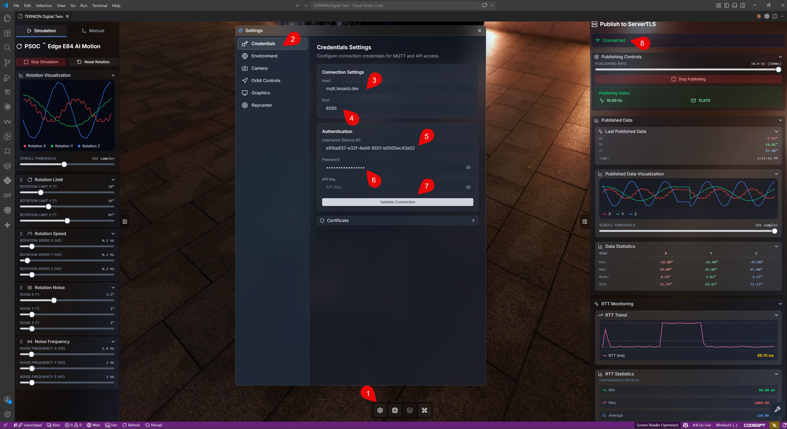
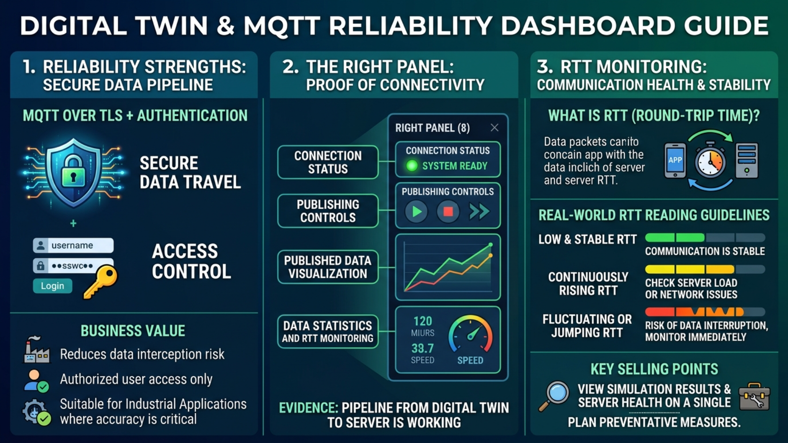
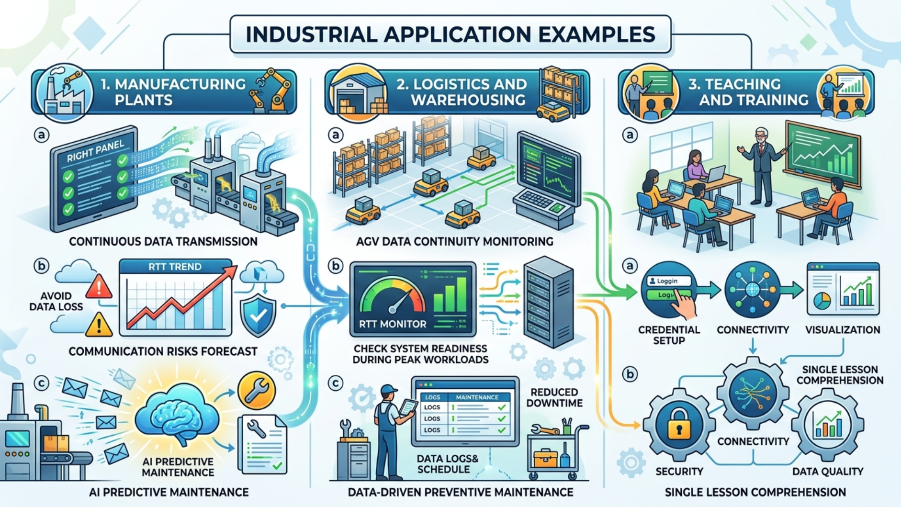

# M8 - Credential Setup and Right Panel Visualization: เชื่อมต่ออย่างน่าเชื่อถือและมองเห็นสุขภาพ Server แบบเรียลไทม์

## Introduction

หลังจาก M7 ที่เราเรียนรู้เรื่อง Motion Simulation แล้ว บทนี้จะพาเข้าสู่ขั้นตอนที่ทำให้ระบบพร้อมใช้งานจริงในองค์กร คือการตั้งค่า **Credential** เพื่อเชื่อมต่อเซิร์ฟเวอร์ และการใช้ **Panel ด้านขวา** เพื่อตรวจผลการทำงานแบบเรียลไทม์

หัวใจของ M8 มี 2 เรื่องสำคัญ:

1. **การเชื่อมต่อที่เชื่อถือได้** ผ่าน `MQTT over TLS` พร้อม `Username/Password`
2. **การติดตามสุขภาพระบบ** ผ่าน `RTT Monitoring` ซึ่งเป็นจุดขายสำคัญของแอปพลิเคชันนี้

---

## ทำไมบทนี้จึงสำคัญ

- **เชื่อมจากเดโมสู่ระบบจริง:** ข้อมูลจาก Digital Twin ถูกส่งไปยัง Server ได้จริง
- **น่าเชื่อถือในระดับองค์กร:** ใช้ MQTT Server แบบ TLS และยืนยันตัวตนก่อนใช้งาน
- **มองเห็นสุขภาพการสื่อสารได้ทันที:** RTT ช่วยบอกความเสถียรของระบบแบบใกล้เรียลไทม์
- **ตัดสินใจได้เร็วขึ้น:** เห็นทั้งสถานะเชื่อมต่อ การ publish และแนวโน้มข้อมูลในหน้าจอเดียว
- **พร้อมต่อยอด AI และ Machine Learning (ML):** เมื่อข้อมูลส่งต่อเนื่อง ก็พร้อมสำหรับงานวิเคราะห์เชิงลึก

---

## Objective

- ตั้งค่า Credential เพื่อเชื่อมต่อ Server ได้ถูกต้อง
- เข้าใจบทบาทของ `MQTT over TLS` และ `Username/Password` ต่อความปลอดภัยและความน่าเชื่อถือ
- ใช้ Right Panel เพื่อตรวจสถานะการทำงานและคุณภาพข้อมูล
- ใช้ `RTT Monitoring` เพื่อติดตามสุขภาพ Server และเฝ้าระวังความผิดปกติ

## Learning Outcomes

หลังจบบทนี้ คุณจะสามารถ:

- กรอกค่า Credentials ได้ครบและถูกต้อง
- อธิบายจุดแข็งของระบบในมุมความปลอดภัยของข้อมูลได้
- ตรวจสอบสถานะเชื่อมต่อและการส่งข้อมูลจาก Right Panel ได้
- อ่านค่า RTT เพื่อตีความสุขภาพ Server เบื้องต้นได้

---

## วิเคราะห์ภาพรวมจากหน้าจอ M8

จากภาพนี้ เราเห็นโฟลว์ใช้งานครบตั้งแต่ตั้งค่าจนถึงตรวจผล:

- **(1)** เปิดเมนู Settings
- **(2)** เข้าแท็บ Credentials
- **(3)** กรอก Server Host
- **(4)** กรอก Port
- **(5)** กรอก Username/Client ID
- **(6)** กรอก Password หรือ API Key
- **(7)** กด Validate/Connect
- **(8)** ตรวจสถานะและกราฟจาก Panel ด้านขวา

---

## ก่อนเริ่มตั้งค่า Credential

1. เตรียมข้อมูลจากผู้ดูแลระบบ: Host, Port, Username/Client ID, Password หรือ API Key
2. ตรวจว่าเครือข่ายเข้าถึง Server ได้
3. ยืนยันว่า Server เปิดใช้ `MQTT over TLS` (เพื่อเข้ารหัสข้อมูล)
4. หากองค์กรบังคับใช้ใบรับรอง ให้เตรียม Certificate ตามนโยบาย

---

## ขั้นตอนตั้งค่า Credential (Step-by-step)

วิดีโอสาธิตสำหรับทำตามทีละขั้น: [Credential Setup and Right Panel Demo (M8)](https://youtu.be/8UUb6yPx4WU)

### 1) เปิด Settings และเลือก Credentials

จากหน้าจอหลัก กดปุ่ม Settings (1) แล้วเลือกแท็บ **Credentials** (2)

### 2) กรอกข้อมูลการเชื่อมต่อ

กรอกตามลำดับ:

1. **Server Host** (3)
2. **Port** (4)
3. **Username/Client ID** (5)
4. **Password หรือ API Key** (6)

ตรวจตัวสะกดทุกช่องก่อนยืนยัน โดยเฉพาะ Host และ Password/API Key

### 3) ยืนยันการเชื่อมต่อ

กด **Validate/Connect** (7) เพื่อทดสอบการเชื่อมต่อ หากผ่าน ระบบจะพร้อม publish ข้อมูล

---

## จุดแข็งด้านความน่าเชื่อถือ: MQTT over TLS + Authentication

แอปพลิเคชันนี้ไม่ได้เน้นแค่การแสดงผล แต่เน้น "ความเชื่อถือได้ของข้อมูล" ตั้งแต่ต้นทาง โดยรองรับ MQTT Server ที่เข้ารหัสด้วย TLS และบังคับยืนยันตัวตนด้วย Username/Password

คุณค่าที่ได้ในเชิงธุรกิจ:

- **ข้อมูลเดินทางอย่างปลอดภัย:** ลดความเสี่ยงการดักอ่านข้อมูลระหว่างทาง
- **ควบคุมสิทธิ์การเข้าถึงได้:** จำกัดเฉพาะผู้ใช้หรือระบบที่ได้รับอนุญาต
- **เหมาะกับงานอุตสาหกรรมจริง:** โดยเฉพาะระบบที่ความถูกต้องและความน่าเชื่อถือสำคัญมาก

---

## การอ่านผลจาก Right Panel Visualization

เมื่อเชื่อมต่อสำเร็จแล้ว ให้ดู Panel ด้านขวา (8) โดยโฟกัส 4 ส่วนหลัก:

- **Connection Status:** ยืนยันว่าระบบพร้อมใช้งาน
- **Publishing Controls:** เริ่มหรือหยุดการส่งข้อมูลตามแผนทดสอบ
- **Published Data Visualization:** ดูแนวโน้มข้อมูลที่ส่งออก
- **Data Statistics และ RTT Monitoring:** ประเมินคุณภาพข้อมูลและความเสถียรของการสื่อสาร

Right Panel จึงเป็นหลักฐานว่า pipeline ตั้งแต่ Digital Twin ไปถึง Server ทำงานจริง

---

## RTT Monitoring: จุดขายที่ต้องเน้น

`RTT (Round-Trip Time)` คือเวลาที่ข้อมูลเดินทางไป-กลับระหว่างแอปกับ Server ค่านี้ช่วยให้ทีมมองเห็นสุขภาพการสื่อสารของระบบได้รวดเร็ว

แนวทางอ่านค่า RTT แบบใช้งานจริง:

- **RTT ต่ำและนิ่ง:** ระบบสื่อสารมีเสถียรภาพดี
- **RTT สูงขึ้นต่อเนื่อง:** ควรตรวจโหลด Server หรือปัญหาเครือข่าย
- **RTT แกว่งหรือกระโดดเป็นช่วง:** อาจมีความเสี่ยงข้อมูลขาดช่วง ควรเฝ้าระวังทันที

จุดเด่นคือผู้ใช้มองเห็นทั้ง "ผลการจำลอง" และ "สุขภาพ Server" ได้จากหน้าจอเดียว ทำให้วางแผนแก้ไขเชิงป้องกันได้ก่อนเกิดปัญหาใหญ่

---

## ตัวอย่างการนำไปใช้ในอุตสาหกรรม

1. **โรงงานผลิต**
   - ใช้ Right Panel ยืนยันว่าเครื่องจักรส่งข้อมูลเข้า Server ต่อเนื่อง
   - ใช้ RTT Trend ช่วยเตือนความเสี่ยงการสื่อสารก่อนข้อมูลตกหล่น
   - ส่งข้อมูลต่อให้ AI เพื่อทำ Predictive Maintenance

2. **โลจิสติกส์และคลังสินค้า**
   - ตรวจความต่อเนื่องข้อมูลของ AGV แบบเรียลไทม์
   - ใช้ RTT Monitor ตรวจความพร้อมของระบบช่วงงานหนาแน่น
   - ลด downtime ด้วย Preventive Maintenance ที่อิงข้อมูลจริง

3. **การสอนและการฝึกอบรม**
   - สาธิตครบเส้นทางจาก Credential Setup ไปถึง Visualization
   - ผู้เรียนเห็นภาพความสัมพันธ์ของ Security, Connectivity และ Data Quality ในบทเดียว

---

## ปัญหาที่พบบ่อยและวิธีแก้เบื้องต้น

- **เชื่อมต่อไม่ผ่าน:** ตรวจ Host, Port, Username และ Password/API Key อีกครั้ง
- **ไม่ขึ้น Connected:** ตรวจเครือข่าย, สิทธิ์ใช้งาน และ Certificate (ถ้ามี)
- **publish แล้วกราฟไม่วิ่ง:** ตรวจว่าแหล่งข้อมูลกำลังทำงาน และลองเริ่ม publish ใหม่
- **RTT สูงหรือแกว่งผิดปกติ:** ตรวจความเสถียรเครือข่ายและภาระของ Server

---

## ข้อความทิ้งท้าย

M8 คือบทที่ทำให้แพลตฟอร์ม "พร้อมใช้งานจริง" เพราะผู้ใช้ตั้งค่าเชื่อมต่อได้อย่างปลอดภัยผ่าน MQTT over TLS พร้อมยืนยันตัวตน และยังติดตามสุขภาพ Server ได้ผ่าน RTT Monitoring ซึ่งเป็นจุดแข็งสำคัญที่ตอบโจทย์งานอุตสาหกรรมจริง
