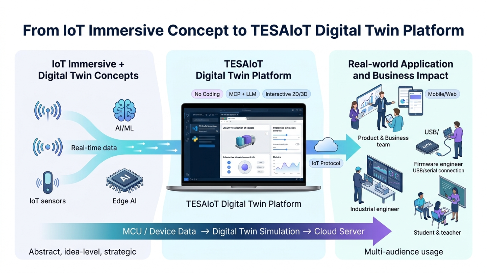

# TESAIoT Digital Twin Course

Professional learning content for TESAIoT Digital Twin, covering the full path from foundational concepts to secure server-connected simulation.

คอร์สนี้ออกแบบให้เรียนเป็นลำดับจากพื้นฐานสู่การใช้งานจริง โดยเน้นการลงมือทำแบบเป็นขั้นตอน พร้อมสื่อและโมดูลที่เหมาะกับทั้งผู้สอน ผู้เรียน และทีมพัฒนาโซลูชัน.

## Table of Contents

- [Why This Course](#why-this-course)
- [Learning Path (M1-M8)](#learning-path-m1-m8)
- [Course Videos](#course-videos)
- [Recommended Study Flow](#recommended-study-flow)
- [Who This Is For](#who-this-is-for)
- [Quick Start](#quick-start)
- [Repository Structure](#repository-structure)
- [Contributing](#contributing)
- [License](#license)

## Why This Course

- Provide a practical and visual introduction to IoT Immersive and Digital Twin concepts.
- Guide learners through setup, model preparation, simulation, and secure data transmission.
- Support no-code and low-code workflows that can later scale to AI/ML/Edge AI scenarios.

## Learning Path (M1-M8)

| Module | Topic                                            | Link                                                           |
| ------ | ------------------------------------------------ | -------------------------------------------------------------- |
| M1     | Introduction to IoT Immersive and Digital Twin   | [M1-Introduction.md](./M1-Introduction.md)                     |
| M2     | Introduction to TESAIoT Digital Twin Platform    | [M2-TESAIoT-Digital-Twin.md](./M2-TESAIoT-Digital-Twin.md)     |
| M3     | Installation, Connectivity, and Setup Validation | [M3-Installation-and-Setup.md](./M3-Installation-and-Setup.md) |
| M4     | Free Loader                                      | [M4-Free-Loader.md](./M4-Free-Loader.md)                       |
| M5     | Model Loader                                     | [M5-Model-Loader.md](./M5-Model-Loader.md)                     |
| M6     | Model Catalog                                    | [M6-Model-Catalog.md](./M6-Model-Catalog.md)                   |
| M7     | Motion Simulation                                | [M7-Motion-Simulation.md](./M7-Motion-Simulation.md)           |
| M8     | Credential Setup and Right Panel Visualization   | [M8-Send-Data-to-Server.md](./M8-Send-Data-to-Server.md)       |

## Course Videos

Direct YouTube links from the modules:

- M6: [Model Catalog Demo](https://youtu.be/staK480xsiI)
- M7: [Motion Simulation Demo](https://youtu.be/RJBK2A5r0us)
- M8: [Credential Setup and Right Panel Demo](https://youtu.be/8UUb6yPx4WU)

### Video Previews

## Recommended Study Flow

1. Start with M1-M2 for core concepts and platform understanding.
2. Complete M3 to prepare your environment and connectivity.
3. Continue with M4-M6 to build and manage 3D assets.
4. Use M7 for motion behavior simulation.
5. Finish with M8 for secure server communication and runtime monitoring.

## Who This Is For

- Instructors and students in IoT, embedded systems, and digital manufacturing.
- Product and solution teams building Digital Twin demos or pilots.
- Engineers validating data flow from edge devices to cloud/server systems.
