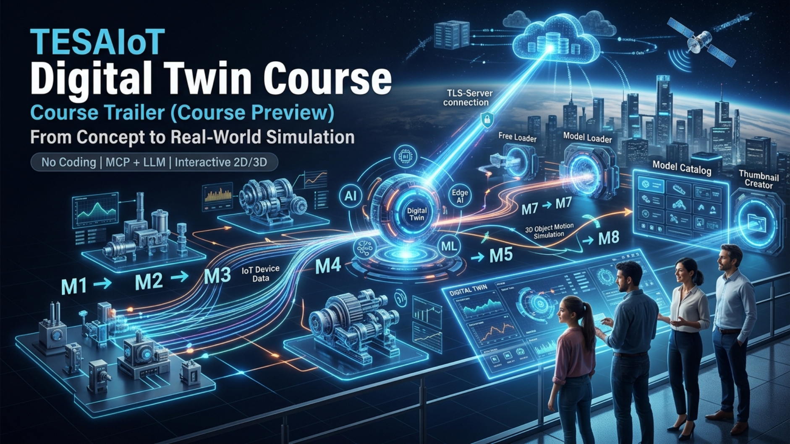

# TESAIoT Digital Twin Course

From concept to real-world simulation, this course helps you build practical Digital Twin capability step by step.

คอร์สนี้ออกแบบให้เริ่มง่าย แต่ผลลัพธ์ระดับใช้งานจริง ครอบคลุมตั้งแต่พื้นฐาน IoT Immersive และ Digital Twin ไปจนถึง 3D Motion Simulation และการส่งข้อมูลไปยัง TLS-Server อย่างปลอดภัย

## Table of Contents

- [Course Trailer](#course-trailer)
- [What You Will Benefit](#what-you-will-benefit)
- [Learning Path (M1-M8)](#learning-path-m1-m8)
- [Course Videos](#course-videos)
- [Recommended Study Flow](#recommended-study-flow)
- [Who This Is For](#who-this-is-for)
- [Explore More](#explore-more)

## Course Trailer

สัมผัสเส้นทางการเรียนที่พาคุณจาก “เข้าใจแนวคิด” ไปสู่ “สร้างเดโมและระบบจำลองที่ใช้งานได้จริง” ใน workflow เดียว  
ดูรายละเอียดฉบับเต็มได้ที่ [Course Trailer (Course Preview)](./Course-Trailer-Course-Preview.md)

## What You Will Benefit

- เรียนรู้แบบลงมือทำจริง ตั้งแต่ setup ถึงการเชื่อมต่อ TLS-Server
- ลดเวลาสร้างต้นแบบด้วยโมเดลและ assets พร้อมใช้จาก Free Loader และ Model Loader
- จัดการโมเดลเป็นระบบด้วย Model Catalog และ Thumbnail Creator
- จำลองการเคลื่อนไหว 3D แบบ Auto และ Manual เพื่อทดสอบพฤติกรรมก่อนใช้งานจริง
- มองเห็นโอกาสต่อยอด AI/ML/Edge AI ด้วยข้อมูลและ simulation ที่เป็นรูปธรรม

ดูรายละเอียดฉบับเต็มได้ที่ [What's your benefit?](./Whats-your-benefit.md)

## Learning Path (M1-M8)

| Module | Topic                                                               | Link                                                           |
| ------ | ------------------------------------------------------------------- | -------------------------------------------------------------- |
| M1     | Introduction to IoT Immersive and Digital Twin                      | [M1-Introduction.md](./M1-Introduction.md)                     |
| M2     | Introduction to TESAIoT Digital Twin Platform                       | [M2-TESAIoT-Digital-Twin.md](./M2-TESAIoT-Digital-Twin.md)     |
| M3     | Installation, Connectivity, and Setup Validation                    | [M3-Installation-and-Setup.md](./M3-Installation-and-Setup.md) |
| M4     | Using Free Models and Assets for free (Free Loader)                 | [M4-Free-Loader.md](./M4-Free-Loader.md)                       |
| M5     | Using Models and Assets given by TESAIoT Model Store (Model Loader) | [M5-Model-Loader.md](./M5-Model-Loader.md)                     |
| M6     | Model Catalog and Thumbnail Creator                                 | [M6-Model-Catalog.md](./M6-Model-Catalog.md)                   |
| M7     | 3D Object Motion Simulation (Auto & Manual Modes)                   | [M7-Motion-Simulation.md](./M7-Motion-Simulation.md)           |
| M8     | Sending Simulation Data to TLS-Server                               | [M8-Send-Data-to-Server.md](./M8-Send-Data-to-Server.md)       |

## Course Videos

Direct YouTube links from the modules:

- M6: [Model Catalog and Thumbnail Creator Demo](https://youtu.be/staK480xsiI)
- M7: [3D Object Motion Simulation (Auto & Manual Modes) Demo](https://youtu.be/RJBK2A5r0us)
- M8: [Sending Simulation Data to TLS-Server Demo](https://youtu.be/8UUb6yPx4WU)

### Video Previews

## Recommended Study Flow

1. Start with M1-M2 for core concepts and platform understanding.
2. Complete M3 to prepare your environment and connectivity.
3. Continue with M4-M6 to build and manage 3D assets.
4. Use M7 for motion behavior simulation.
5. Finish with M8 for secure server communication and runtime monitoring.

## Who This Is For

- Instructors and students in IoT, embedded systems, and digital manufacturing.
- Product and solution teams building Digital Twin demos or pilots.
- Engineers validating data flow from edge devices to cloud/server systems.

## Explore More

- Full trailer page: [Course Trailer (Course Preview)](./Course-Trailer-Course-Preview.md)
- Full benefits page: [What's your benefit?](./Whats-your-benefit.md)
- Start now: [M1-Introduction.md](./M1-Introduction.md)
