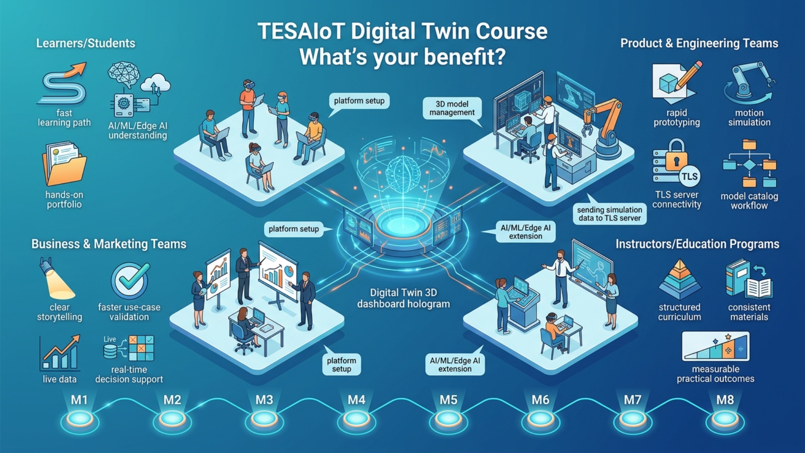

# What's your benefit?

ไม่ใช่แค่เรียนรู้เทคโนโลยี แต่คือการได้เครื่องมือและแนวคิดที่พร้อมใช้จริงกับงานของคุณทันที  
**TESAIoT Digital Twin Course** ถูกออกแบบเพื่อให้คุณเปลี่ยนจาก “เข้าใจแนวคิด” ไปสู่ “สร้างผลลัพธ์จริง” ได้เร็วขึ้น ชัดขึ้น และมั่นใจขึ้น

## ทำไมคอร์สนี้ถึงคุ้มกับเวลาของคุณ

- เห็นภาพรวม Digital Twin, IoT, AI/ML/Edge AI แบบเชื่อมกันทั้งระบบ
- ได้ประสบการณ์ลงมือทำจริงตั้งแต่ setup ไปจนถึงส่งข้อมูลสู่ TLS-Server
- ลดเวลาลองผิดลองถูกด้วย workflow ที่วางไว้ครบตั้งแต่ M1 ถึง M8
- มีผลงานเชิงปฏิบัติที่นำไปใช้ต่อได้ทั้งในงานเรียน งานพัฒนา และงานนำเสนอ

## ประโยชน์ที่ชัดเจนสำหรับแต่ละกลุ่ม

### สำหรับผู้เรียนและนักศึกษา

- เข้าใจ Digital Twin และ IoT ตั้งแต่พื้นฐานจนถึงการใช้งานจริง
- เรียนรู้แบบเป็นขั้นตอน ทำให้พัฒนาทักษะได้เร็วและต่อเนื่อง
- เห็นภาพการต่อยอดสู่ AI/ML/Edge AI อย่างจับต้องได้
- มีเดโมและผลงานที่นำไปใช้ในการเรียน การสอบ หรือ portfolio ได้

### สำหรับทีม Product และ Engineering

- ลดเวลาทำต้นแบบและเดโม ด้วยโมเดล/ทรัพยากรที่พร้อมใช้จาก Free Loader และ Model Loader
- ทดสอบพฤติกรรมระบบผ่าน 3D Motion Simulation ก่อนลงฮาร์ดแวร์จริง
- ตรวจสอบเส้นทางข้อมูลและความเสถียรของการเชื่อมต่อ TLS-Server ได้เร็วขึ้น
- ใช้ Model Catalog เป็นจุดกลางในการคัดเลือกโมเดล ลดความคลาดเคลื่อนระหว่างทีม

### สำหรับทีมธุรกิจและการตลาด

- สื่อสารคุณค่าโซลูชันให้ลูกค้าเข้าใจง่ายขึ้นผ่านฉาก Digital Twin ที่มองเห็นได้จริง
- ทดลองแนวคิดและเล่า use case ได้ไว โดยไม่ต้องเริ่มจากการพัฒนาเต็มระบบทันที
- สนับสนุนการตัดสินใจเชิงธุรกิจด้วยข้อมูลและการมอนิเตอร์แบบเรียลไทม์

### สำหรับอาจารย์และหลักสูตรการศึกษา

- มีโครงสร้างเนื้อหาที่สอนต่อเนื่องได้ตั้งแต่พื้นฐานถึงระดับประยุกต์
- ใช้สื่อเดียวกันได้ทั้งห้องเรียน ช่วยลดปัญหาเรื่องไฟล์/เวอร์ชันไม่ตรงกัน
- ทำกิจกรรมภาคปฏิบัติได้ชัดเจนและวัดผลการเรียนรู้ได้ง่ายขึ้น

## ผลลัพธ์ที่คุณจะได้หลังจบคอร์ส

- ตั้งค่าและใช้งาน TESAIoT Digital Twin ได้อย่างมั่นใจ
- จัดการโมเดลและทรัพยากร 3D ได้ตรงโจทย์งานจริง
- จำลองการเคลื่อนไหวและวิเคราะห์พฤติกรรมของระบบได้
- ส่งข้อมูล simulation ไปยัง TLS-Server อย่างปลอดภัย และติดตามสุขภาพการเชื่อมต่อได้
- วางแผนต่อยอด use case ด้าน AI/ML/Edge AI ได้อย่างมีทิศทาง

## พร้อมยกระดับงานของคุณหรือยัง?

เริ่มต้นได้ทันทีที่ [README](./README.md) และเข้าสู่บทแรกที่ [M1-Introduction.md](./M1-Introduction.md) เพื่อเปลี่ยนการเรียนรู้ให้กลายเป็นผลลัพธ์จริง.
